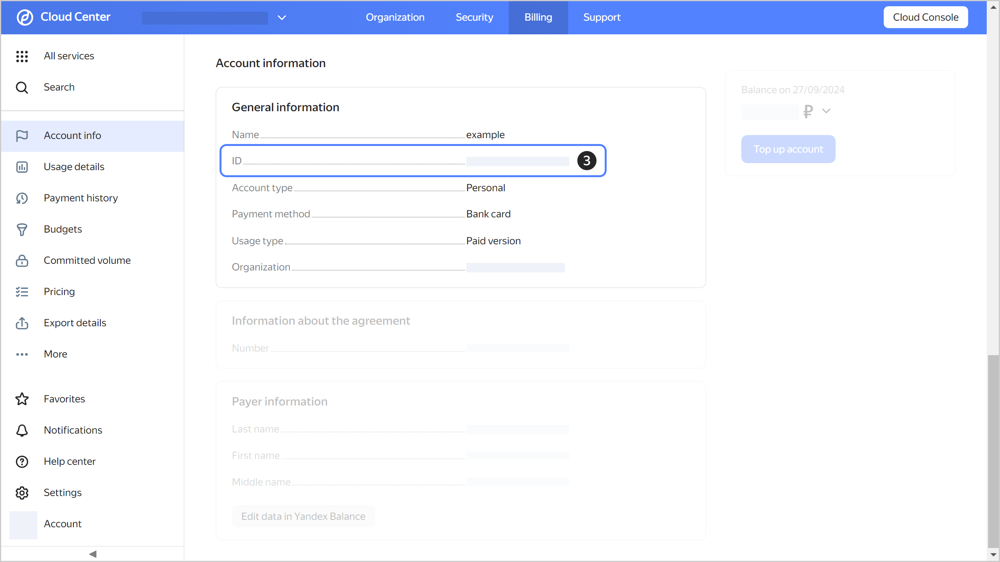



- {{ billing-interface }} {#billing}

  1. 
  1. Select the account whose ID you want to find out.
  1. The billing account ID is displayed on the **{{ ui-key.yacloud_billing.billing.account.switch_overview }}** page under **{{ ui-key.yacloud_billing.billing.account.overview.section_account-data }}**.

  


