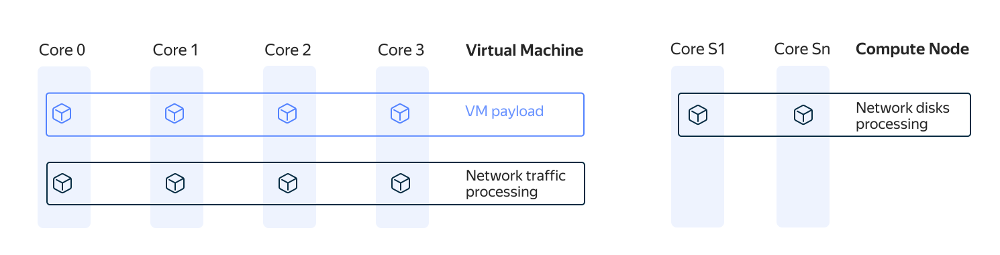

## Regular VM network {#reg-vm}

In the {{ yandex-cloud }} infrastructure, all VMs run in the [QEMU-KVM](https://en.wikipedia.org/wiki/QEMU) virtualization environment. A *hypervisor* proportionally distributes the computing load across all processor cores allocated to a VM.

The computing load can be logically divided into three parts:

* User load: OS processes and user processes run in the OS of a user VM.
* Processes maintaining the operation of [network disks](../../compute/concepts/disk.md).
* Processes for handling the VM's network traffic.

The load distribution across compute cores can be presented as follows:

The diagram shows that the user load and VM network traffic handling are distributed across all compute cores allocated to the VM.

The processes maintaining the operation of [network disks](../../compute/concepts/disk.md) are separated from the user load and run on compute cores from a separate pool, the service cores labeled as `Core S1` and `Core Sn` in the diagram.

You can isolate VM network traffic from the user load using the [software-accelerated network (SAN)](#san) mechanism.

## Software-accelerated network {#san}

*Software network acceleration* is achieved by transferring network traffic processing from the [VM](../../compute/concepts/vm.md) cores to additional compute cores allocated from a shared pool of cores available to a physical server. To enable SAN, you need to completely shut down your VM.

Load distribution across compute cores with SAN enabled can be represented as follows:

The diagram shows the use of additional compute cores (`Core 4` and `Core 5`) for network traffic processing. The number of service compute cores depends on the number of VM cores:

* If a VM is hosted on a single NUMA node of a physical server, two additional compute cores for network traffic will be allocated to it as soon as SAN is enabled (see the diagram).
* If a VM is hosted on two NUMA nodes of a physical server, four additional cores will be allocated to it as soon as SAN is enabled.



The additional compute cores allocated when enabling SAN will not be visible inside the user VM.

You cannot enable SAN on a VM with [performance level](../../compute/concepts/performance-levels.md) below 100%.



This way, SAN ensures that there is no competition between user and service loads for the VM's hardware resources, as all network traffic is processed separately. This minimizes lags and packet losses when transmitting traffic, while the VM's computing resources are freed up to serve the user load.

The [cost](../../compute/pricing.md#software-accelerated-network) of additional hardware resources depends on the [platform](../../compute/concepts/vm-platforms.md) and the number of VM cores.

To enable a software-accelerated network:

* Select the **{{ ui-key.yacloud.component.compute.resources.field_sw-accelerated-net }}** option when [creating a new VM](../../compute/operations/vm-create/create-linux-vm.md) or [reconfigure](../../compute/operations/vm-control/vm-update-resources.md#enable-software-accelerated-network) an existing VM.

* Enable the **{{ ui-key.yacloud.component.compute.resources.field_sw-accelerated-net }}** option in the basic VM configuration when [creating an instance group](../../compute/operations/instance-groups/create-fixed-group.md) or set the `network_settings.type` key to `SOFTWARE_ACCELERATED` in the [YAML specification](../../compute/concepts/instance-groups/specification.md).

## Recommendations for using a software-accelerated network {#use-cases}

We recommend enabling a software-accelerated network to speed up request handling:

* On VMs with custom DB installations in the case of high [disk](../../compute/concepts/disk.md) and CPU utilization (over 70-80%).
* If you see a high `CPU steal time` metric value inside a VM.
* In [{{ managed-k8s-full-name }}](../../managed-kubernetes/concepts/index.md) cluster node groups when using intra-cluster L7 load balancers, e.g., [Ingress NGINX controllers](https://kubernetes.github.io/ingress-nginx/) or [Istio ingress gateways](https://istio.io/latest/docs/tasks/traffic-management/ingress/ingress-control/).



Enabling SAN will not accelerate your [network disks](../../compute/concepts/disk.md).


