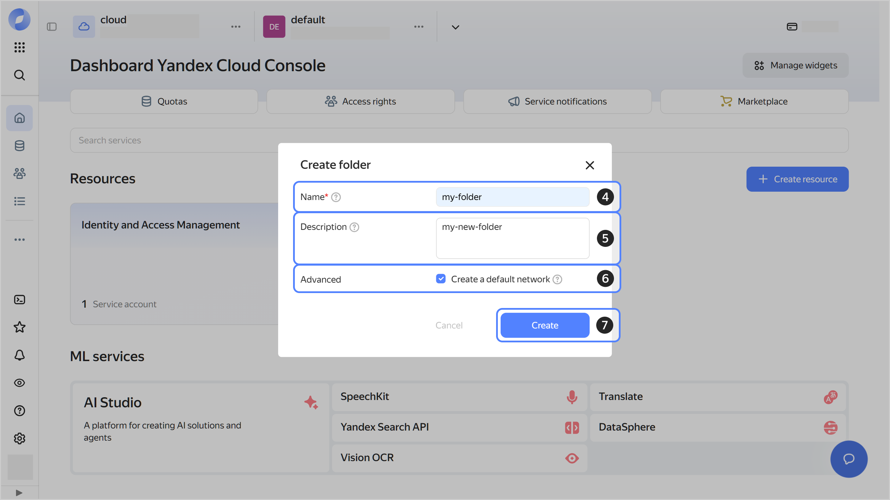

1. In the [management console]({{ link-console-main }}), in the top panel, click  and select the [cloud](../resource-manager/concepts/resources-hierarchy.md#cloud).
1. To the right of the cloud name, click .
1. Select **{{ ui-key.yacloud.component.console-dashboard.button_action-create-folder }}** .

   

1. Give your [folder](../resource-manager/concepts/resources-hierarchy.md#folder) a name. The naming requirements are as follows:

    

1. Optionally, specify the description for your folder.
1. Select **{{ ui-key.yacloud.iam.cloud.folders-create.field_default-net }}**. This will create a [network](../vpc/concepts/network.md#network) with subnets in each availability zone. Within this network, you will also have a [default security group](../vpc/concepts/security-groups.md#default-security-group), within which all network traffic will be allowed.
1. Click **{{ ui-key.yacloud.iam.cloud.folders-create.button_create }}**.

   
