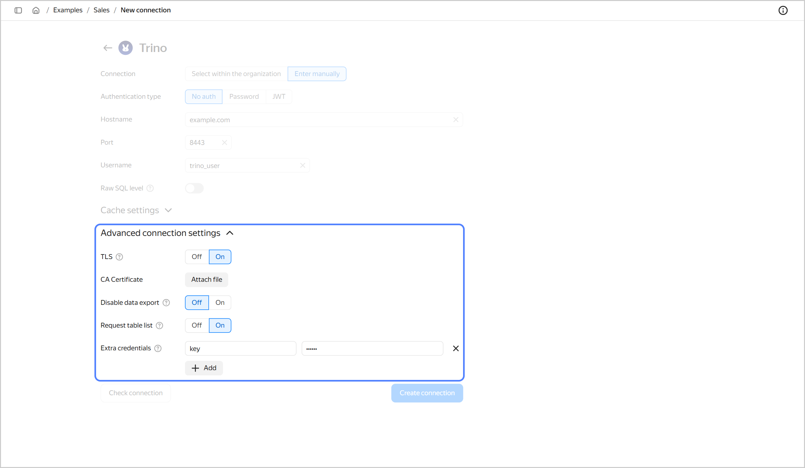

* **TLS**: If this option is enabled, {{ TR }} is accessed via `HTTPS`; if not, `HTTP`.
* **CA Certificate**: To upload a certificate, click **Attach file** and select the certificate file. When the certificate is uploaded, the field shows the file name.
* 
* 

