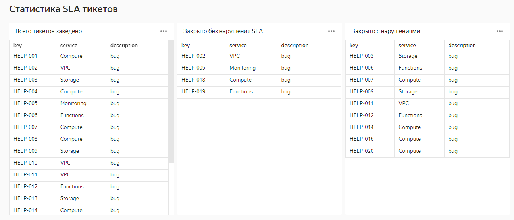



One chart is added three times to the **Ticket SLA statistics** dashboard:

* **Total of tickets created**: The chart is added with no parameter. Data is displayed for all tickets.
* **Closed without SLA violation**: The settings of the chart on the dashboard have the `sla_failed` parameter added with the `not_failed` value. Data is only displayed for the tickets closed with no SLA violations.
* **Closed with violations**: The settings of the chart on the dashboard have the `sla_failed` parameter added with the `failed` value. Data is only displayed for the tickets closed with SLA violations.

