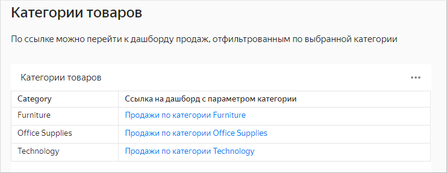
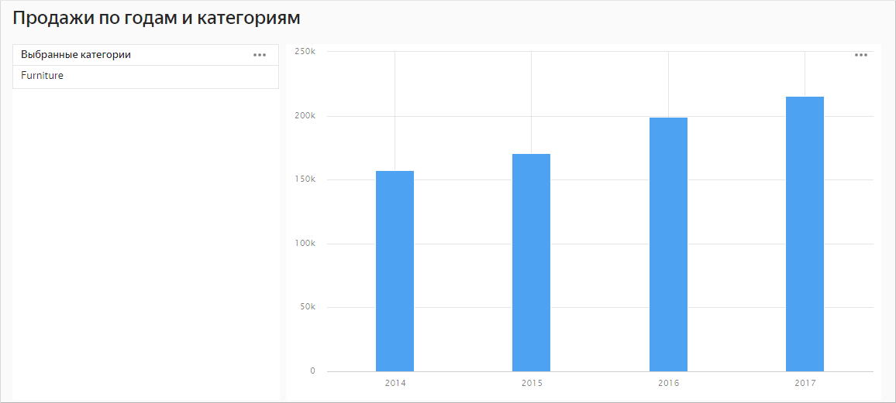



The [Product categories](https://datalens.yandex-team.ru/21nduux7am6ou-kategorii-tovarov) dashboard contains a table with a list of categories.

The first column in the table shows the category name and the second one provides a link to the [Sales by year and category](https://datalens.yandex-team.ru/tscm97gauiz6l-prodazhi-po-godam-i-kategoriyam) dashboard whose settings contain the `category` parameter. The link also specifies the `category` parameter set to the category name. Clicking the link will open the dashboard with the filter by category name applied.

For example, clicking the [https://datalens.yandex-team.ru/tscm97gauiz6l-prodazhi-po-godam-i-kategoriyam?category=Furniture](https://datalens.yandex-team.ru/tscm97gauiz6l-prodazhi-po-godam-i-kategoriyam?category=Furniture) link will open the dashboard with the filter by the `Furniture` category applied.

