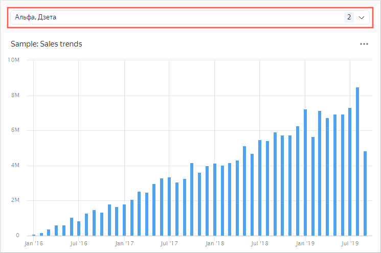

When creating a link between widgets on a dashboard, you may encounter a situation when the link does not work. This usually happens when you create a link between a selector and a chart built from different datasets. The cause is a link between widgets based on a field not used to pick values in the selector:

1\. There is a chart on the dashboard named `Sample: Sales trends` built from a dataset called `Sample CH Sales`.

There is a field in the dataset (chart) called `ShopID` which takes string values, such as `sp-11`, `sp-18`, and `sp-23`.

2\. The `Sample CH ShopList` dataset serves as the store directory. It includes two fields: `ShopID` and `ShopName`.

3\. We will add a selector on the `ShopName` field to the dashboard. The field contains the shop name (`Tau`, `Zeta`, `Kappa`) from the `Sample CH ShopList` dataset.

4\. We will create a link between the selector and the `Sample: Sales trends` chart using an alias. It is not possible to create a link based on the store name since it is not included in the `Sample CH Sales` dataset used to build the chart.

Therefore, we will create the link using the `ShopID` field.

As a result, the values picked by the selector do not have any effect on chart visualization  because the widgets are linked through the `ShopID` field, and the the selector picks its values from the `ShopName` field.



At the same time, the values picked by the selector don't have any effect on chart visualization.





The link is illegal because you cannot use one field to pick values for a dataset-based selector and a different field as the target of a link between datasets. This link mechanism is not supported.
