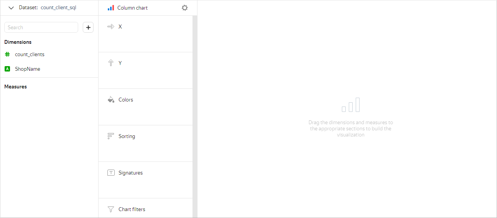
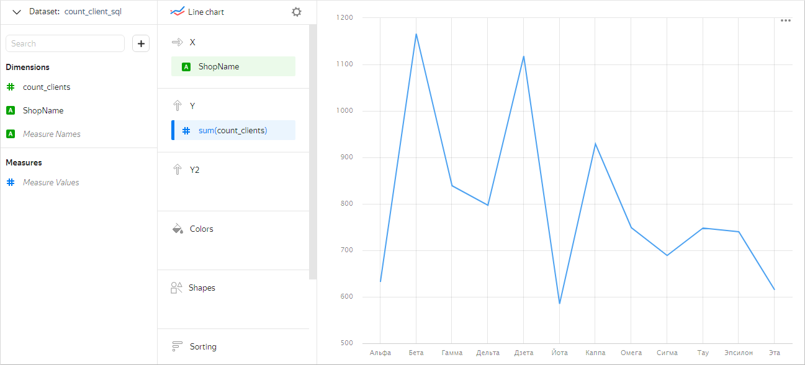
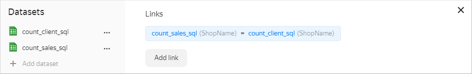
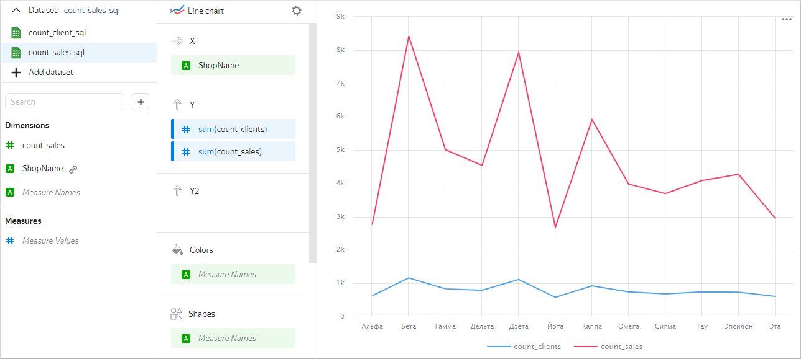
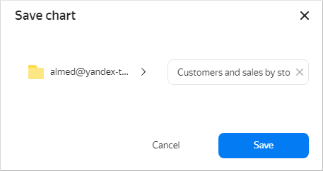

We'll use a demo {{ CH }} database with sales data from a Moscow store chain as our data source. For an example of creating a connection, see the [use case](../../datalens/tutorials/data-from-ch-visualization.md#step1).

1\. Build two datasets using a [SQL query against the data source](../../datalens/operations/dataset/add-data.md):

   * SQL query code for the `count_client_sql` dataset:

   ```sql
   SELECT samples.MS_Shops.ShopName, count(t2.ClientID) AS count_clients
   FROM samples.MS_Shops,
   (SELECT DISTINCT samples.MS_Shops.ShopID, samples.MS_Shops.ShopName, samples.MS_SalesFacts.ClientID
   FROM samples.MS_SalesFacts
   INNER JOIN samples.MS_Shops 
   ON samples.MS_Shops.ShopID=samples.MS_SalesFacts.ShopID) AS t2
   WHERE t2.ShopName=samples.MS_Shops.ShopName
   GROUP BY ShopName
   ```

   * SQL query code for the `count_sales_sql` dataset:

   ```sql
   SELECT DISTINCT samples.MS_Shops.ShopName, COUNT(*) AS count_sales
   FROM samples.MS_SalesFacts
   INNER JOIN samples.MS_Shops 
   ON samples.MS_Shops.ShopID=samples.MS_SalesFacts.ShopID
   GROUP BY ShopName
   ```

2\. On the {{ datalens-full-name }} homepage, click **Create chart**.
3\. Under **Dataset**, select the `count_client_sql` dataset.

   

4\. Select **Line chart** as your chart type.
5\. Drag the `ShopName` dimension from your dataset to the **X** section.This will display the values at the bottom of the chart along the X axis.
6\. Drag the `count_clients` indicator from your dataset to the **Y** section. This will display the values along the Y axis as a chart.

   

7\. Under the dataset list, click **Add dataset** and select `count_sales_sql`.
8\. In the resulting window, a link is automatically created based on the `ShopName` field. Click **Save**.

   

9\. Drag the `count_sales` indicator from your dataset to the **Y** section.This will display the values along the Y axis as a second chart.

   

10\. At the top of the screen, click **Save**. In the resulting window, enter the following name for the chart: `Customers and sales by store - Line chart`. Then click **Save**.

   

