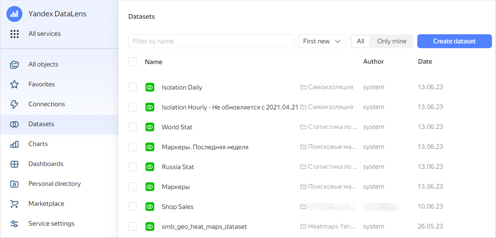
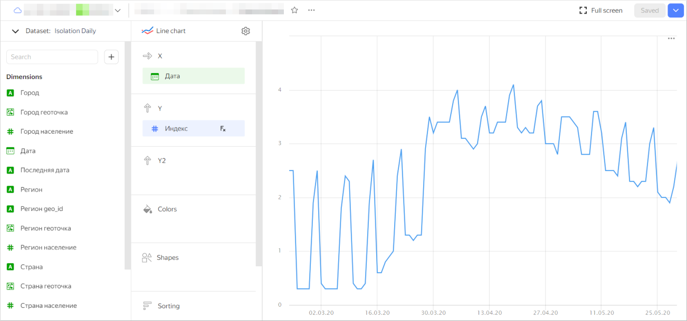
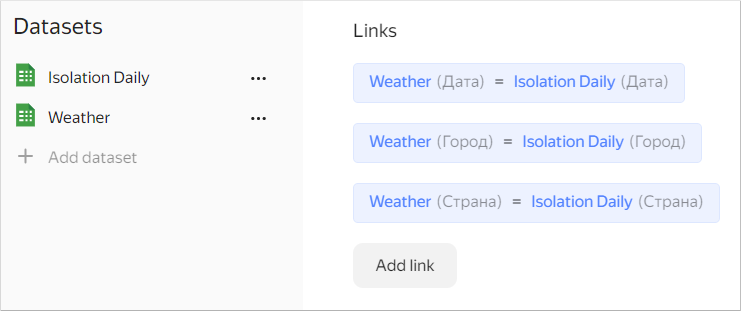
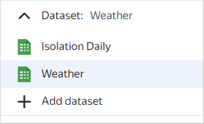
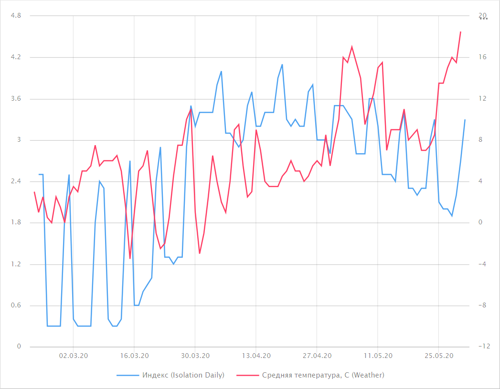

As an example, we will use free datasets from the [marketplace](../../datalens/concepts/marketplace.md) as the data source:

1. [Deploy](../../datalens/operations/marketplace/add-marketplace-product.md) the marketplace dataset named **Coronavirus. Dashboard and data**.
1. Similarly, deploy the marketplace dataset named **Weather**.
1. Use the left-hand navigation panel to switch to the **Datasets** section and select the **Isolation Daily** dataset.

   

1. At the top right, click **Create chart**.
1. Select **Line chart** as your chart type.
1. Drag the `Date` dimension to the **X** section.
1. Drag the `City` dimension to the **Filters** section. Select a value, e.g., `Moscow`.
1. Drag the `Index` measure to the **Y** section. The resulting chart displays changes to the self-isolation index in Moscow.

   

1. At the top left of the screen, click  in front of the **Dataset: Isolation Daily** field.
1. Click **Add dataset** and select the **Weather** dataset.
1. In the window that opens, make sure the links are set by the `Date`, `City`, and `Country` fields.

   

1. In the chart dataset list, select **Weather**.

   

1. Drag the `Average temperature` measure to the **Y2** section.
1. Drag the `Date` dimension to the **Filters** section. Set the condition: `later than February 21, 2020` (date from which the self-isolation index is calculated).
1. At the top right, click **Save**. Enter the chart name and click **Save**.

The resulting chart visualizes data from the two datasets and allows comparing the weather and self-isolation data.
