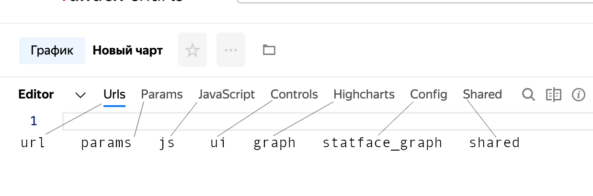
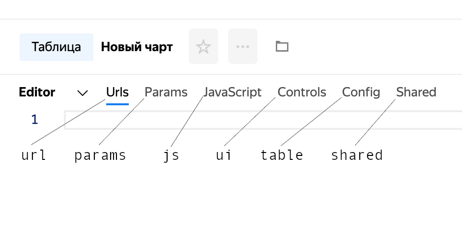
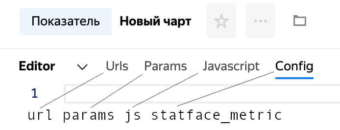
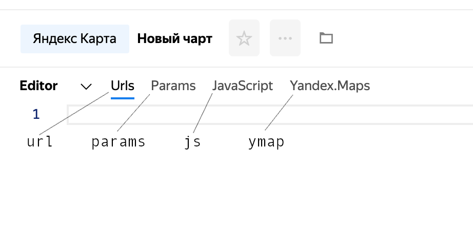
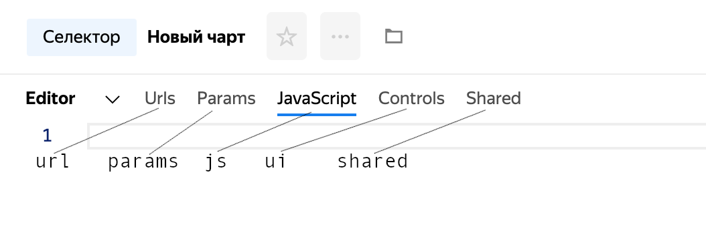
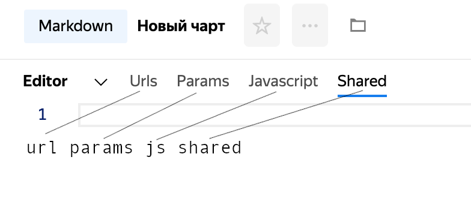
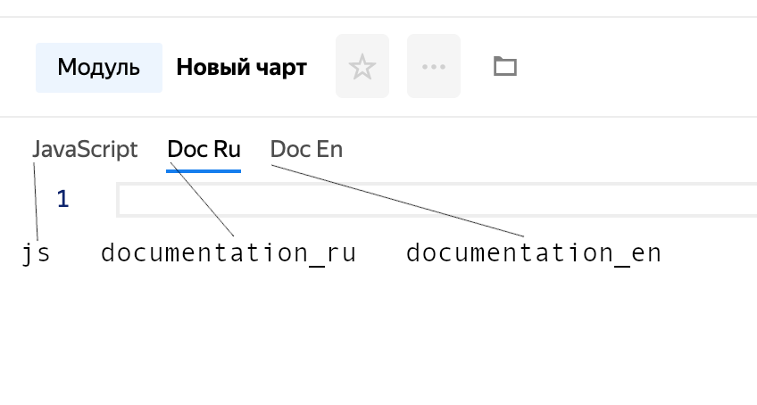

## Creation {#create}

[Authentication](../../../../datalens/api/auth.md)

`POST` `https://api.charts.yandex.net/v1/charts`

### Request body format {#request-body-format-create}
```
{
    data: <Object — Chart data>
    key: <String — Entity key in US>
    type¹: <String — Chart type in ChartKit (such as "graph_node")>
    template¹: <String — Template type used to generate a generated chart (such as "datalens")>
}
```

¹ Only specify one of the two.

### Charts with `type`: {#charts-with-type-create}

Acceptable type values:
* graph_node — Chart.
* table_node — Table.
* metric_node — Measure.
* ymap_node — Map.
* control_node — Selector.
* markdown_node — Markdown widget.
* module — Module.

#### `graph_node` — {#graph-node-create} chart.
```
{
    // data stores contents of the tabs
    url: "...",
    params: "...",
    js: "...",
    ui: "...",
    graph: "...",
    statface_graph: "...",
    shared: "..."
}
```



#### `table_node` — {#table-node-create} table.
```
{
    // data stores contents of the tabs
    url: "...",
    params: "...",
    js: "...",
    ui: "...",
    table: "...",
    shared: "..."
}
```



#### `metric_node` — {#metric-node-create} measure.
```
{
    // data stores contents of the tabs
    url: "...",
    params: "...",
    js: "...",
    statface_metric: "..."
}
```



#### `ymap_node` — {#ymap-node-create} map.
```
{
    // data stores contents of the tabs
    url: "...",
    params: "...",
    js: "...",
    ymap: "..."
}
```



#### `control_node` — {#control-node-create} selector.
```
{
    // data stores contents of the tabs
    url: "...",
    params: "...",
    js: "...",
    ui: "...",
    shared: "..."
}
```



#### `markdown_node` — {#md-node-create} markdown widget.
```
{
    // data stores contents of the tabs
    url: "...",
    params: "...",
    js: "...",
    shared: "..."
}
```



#### `module` — {#module-create} module.
```
{
    // data stores contents of the tabs
    js: "...",
    documentation_ru: "...",
    documentation_en: "..."
}
```



### Charts with `template`: {#charts-with-teplate-create}
Currently, generated charts like this are used for DataLens and Monitoring, they're not that easy to use as traditional charts, where everything is done manually, but they let you create charts through interfaces other than ChartsEditor (such as DataLens Wizard).

### Response format {#response-format-1-create}
```
{
    data: <Object — Chart data>
    entryId: <String — Entity ID in US>
    key: <String — Entity key in US>
    type: <String — Chart type in ChartKit (such as "graph_node")>
}
```

### Example query{#request-format-create}

```bash
curl --request POST \
  --url https://api.charts.yandex.net/v1/charts \
  --header "authorization: OAuth $CHARTS_OAUTH_TOKEN" \
  --header "content-type: application/json;charset=UTF-8" \
  --data '{
    "data": {
        "js": "const Dataset = require('\''libs/dataset/v1'\'');\nconst moment = require('\''vendor/moment/v2.21'\'');\nconst params = ChartEditor.getParams();\nconst loadedData = ChartEditor.getLoadedData();\nconsole.log(loadedData);\nconst preparedData = Dataset.processData(loadedData);\nconsole.log(preparedData);\nconst head = [    {        id: '\''category'\'',        name: '\''Category'\'',        type: '\''stirng'\''    },    {        id: '\''profit'\'',        name: '\''Profit'\'',        type: '\''number'\''    }];const rows = [];for (var i = 0; i < preparedData.length; i++) {    rows.push({        values: [            preparedData[i]['\''Category'\''],            preparedData[i]['\''Profit'\'']        ]    });}\nmodule.exports = {head, rows};",
        "ui": "",
        "url": "const Dataset = require('\''libs/dataset/v1'\'');\nconst moment = require('\''vendor/moment/v2.21'\'');\nconst DATE_FORMAT = '\''YYYY-MM-DD'\'';\nconst params = ChartEditor.getParams();\nconst datasetSource = Dataset.buildSource({    id: '\''y55xt5d3p9csw'\'',    columns: ['\''Category'\'', '\''Profit'\''],    where: [{        column: '\''Renamed date'\'',        operation: '\''GTE'\'',        values: ['\''2017-01-01 00:00:00'\'']    }]});\nmodule.exports = {    dataset: datasetSource};",
        "table": "module.exports = {    title: {        text: '\''Table with random data'\'',        style: {            '\''text-align'\'': '\''center'\'',            '\''font-size'\'': '\''16px'\'',            '\''color'\'': '\''#31C733'\''        }    },    sort: '\''date'\'',    order: '\''asc'\''};",
        "params": "module.exports = {    count: 8};",
        "shared": ""
    },
    "key": "Users/apanchuk/brandNewChart",
    "type": "table_node"
}'
```

### Sample response {#response-format-2-create}

```json
{
  "entryId": "ogo5x8piotxul",
  "data": {
    "js": "const Dataset = require('libs/dataset/v1');\nconst moment = require('vendor/moment/v2.21');\nconst params = ChartEditor.getParams();\nconst loadedData = ChartEditor.getLoadedData();\nconsole.log(loadedData);\nconst preparedData = Dataset.processData(loadedData);\nconsole.log(preparedData);\nconst head = [    {        id: 'category',        name: 'Category',        type: 'stirng'    },    {        id: 'profit',        name: 'Profit',        type: 'number'    }];const rows = [];for (var i = 0; i < preparedData.length; i++) {    rows.push({        values: [            preparedData[i]['Category'],            preparedData[i]['Profit']        ]    });}\nmodule.exports = {head, rows};",
    "ui": "",
    "url": "const Dataset = require('libs/dataset/v1');\nconst moment = require('vendor/moment/v2.21');\nconst DATE_FORMAT = 'YYYY-MM-DD';\nconst params = ChartEditor.getParams();\nconst datasetSource = Dataset.buildSource({    id: 'y55xt5d3p9csw',    columns: ['Category', 'Profit'],    where: [{        column: 'Renamed date',        operation: 'GTE',        values: ['2017-01-01 00:00:00']    }]});\nmodule.exports = {    dataset: datasetSource};",
    "table": "module.exports = {    title: {        text: 'Table with random data',        style: {            'text-align': 'center',            'font-size': '16px',            'color': '#31C733'        }    },    sort: 'date',    order: 'asc'};",
    "params": "module.exports = {    count: 8};",
    "shared": ""
  },
  "key": "Users/apanchuk/brandNewChart",
  "meta": {},
  "scope": "widget",
  "type": "table_node",
  "public": false,
  "createdAt": "2019-12-04T17:51:10.517Z",
  "createdBy": "apanchuk",
  "updatedAt": "2019-12-04T17:51:11.112Z",
  "updatedBy": "apanchuk"
}
```
