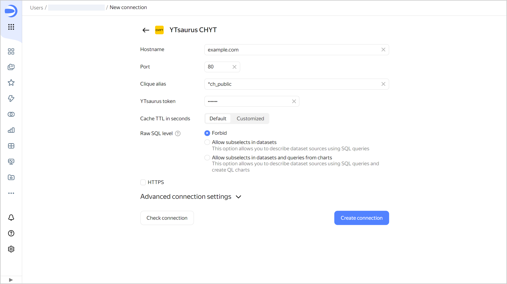

To create a {{ ytsaurus-name }} CHYT connection:

1. Open the [new connection creation page]({{ link-datalens-main }}/connections/new).
1. Under **Databases**, select the **{{ ytsaurus-name }} CHYT** connection.

1. Configure the connection as follows:

   * **Host name**: Specify the {{ ytsaurus-name }} proxy server address.
   * **Port**: Specify the CHYT connection port.
   * **Clique alias**: Specify the alias of a running clique. By default, the `*ch_public` public clique is used.
   * **{{ ytsaurus-name }} token**: Manually set the OAuth token to use with {{ ytsaurus-name }}. For more information, see [this {{ ytsaurus-name }} guide](https://ytsaurus.tech/docs/en/user-guide/storage/auth).
   * **Cache TTL in seconds**: Specify the cache TTL or leave the default value. The recommended value is 300 seconds (5 minutes).

   

   * **HTTPS**. Enable the secure connection option if your server supports HTTPS.

   

1. Optionally, test the connection by clicking **Check connection**.
1. Click **Create connection**.

1. Select a [workbook](../../../datalens/workbooks-collections/index.md) to save your connection to or create a new one. If using legacy folder navigation, select a folder to save the connection to. Click **Create**.

1. Enter a name for the connection and click **Create**.

## Additional settings {#additional-settings}


