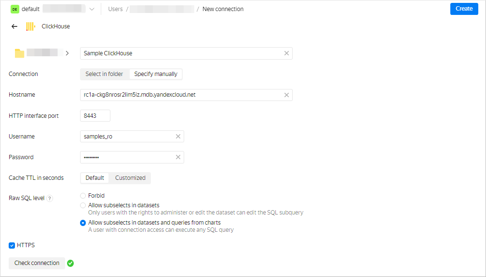
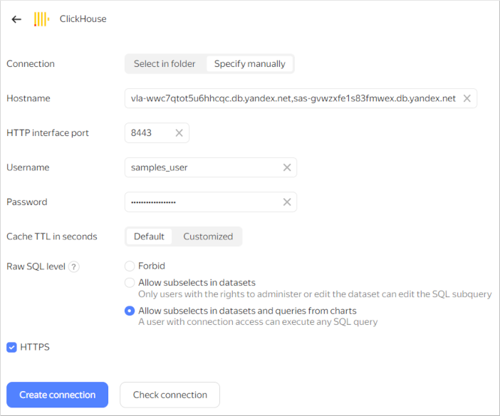

1. Go to the [connections page](https://datalens.yandex.com/connections).Go to the workbook page.
1. Click **Create connection**.Click **Create** → **Connection** in the upper-right corner.
1. Select the **ClickHouse** connection.

   

   1. In the window that opens, specify the connection parameters:

      * Connection type: **Specify manually**.
      * Host name:   `rc1a-ckg8nrosr2lim5iz.{{ dns-zone }}`.
      * HTTP interface port: `8443` (default).
      * Username: `samples_ro`.
      * Password: `MsgfcjEhJk`.

   1. Enable the **HTTPS** option and **Allow subqueries in datasets and queries from charts**.
   1. Check the connection and click **Create connection**.
   1. Enter `Sample ClickHouse` as your connection name.
   1. Click **Create**.

   

   

   1. In the window that opens, specify the connection parameters:

      * Connection type: **Specify manually**.
      * Host name: `vla-wwc7qtot5u6hhcqc.db.yandex.net,sas-gvwzxfe1s83fmwex.db.yandex.net`.
      * HTTP interface port: `8443` (default).
      * Username: `samples_user`.
      * Password: `ilovesamplessomuch`.

   1. Enable **Allow subqueries in datasets and queries from charts**.
   1. Check the connection and click **Create connection**.
   1. Enter `Sample ClickHouse` as your connection name.
   1. Click **Create**.

      

   

Wait for the connection to be saved.
