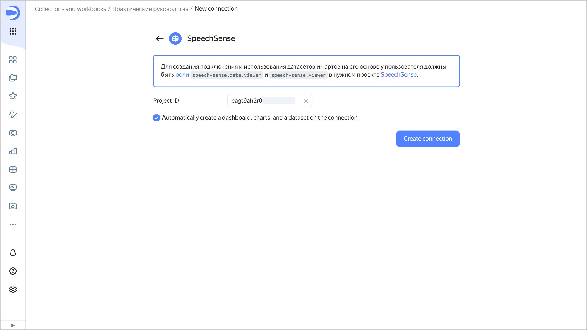

1. Go to the {{ datalens-short-name }} [home page]({{ link-datalens-main }}).
1. In the left-hand panel, select  **Collections and workbooks** and open the required workbook or [create](../../../datalens/workbooks-collections/workbooks-collections-create.md) a new one. If using legacy folder navigation, select a directory or create a new one to save the [connection](../../../datalens/concepts/connection.md) to.

1. In the top-right corner, click **Create** →  **Connection**.
1. Under **Files and services**, select the **{{ speechsense-name }}** connection.
1. Copy the ID of the {{ speechsense-name }} [project](../../../speechsense/concepts/resources-hierarchy.md#project) you need and paste it in the **Project ID** field.
   
1. Leave the **Automatically create dashboard, charts, and dataset over connection** option enabled if you want to get a ready-to-use dashboard, dataset, and a standard set of charts.

   

1. Click **Create connection**.
1. Enter a name for the connection and click **Create**.



If the project with the ID you specified does not exist or the user has no access to it, the connection will not be created and you will get an error.

