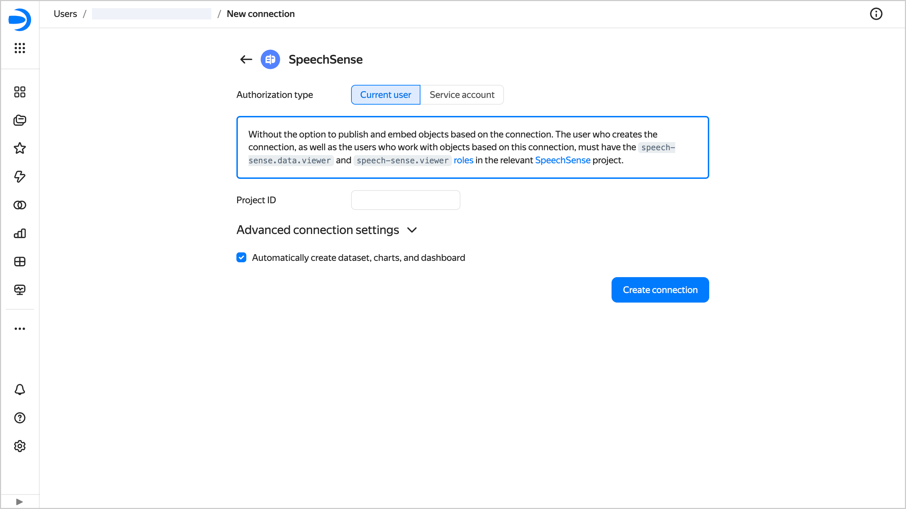
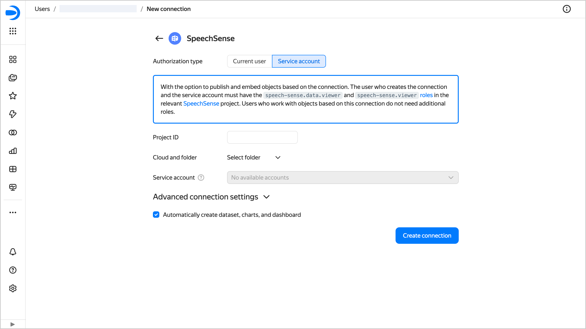

1. Go to the {{ datalens-short-name }} [home page]({{ link-datalens-main-skip-promo }}).
1. In the left-hand panel, select  **Collections and workbooks** and open the required workbook or [create](../../../datalens/workbooks-collections/workbooks-operations.md#create-workbook) a new one. If using legacy folder navigation, select a directory or create a new one to save the [connection](../../../datalens/concepts/connection/index.md) to.
1. In the top-right corner, click **Create** →  **Connection**.
1. Under **Files and services**, select the **{{ speechsense-name }}** connection.
1. Select a sign-in mode and specify the connection settings:

   

   - Current user {#user}

     

     1. Copy the ID of the {{ speechsense-name }} [project](../../../speechsense/concepts/resources-hierarchy.md#project) you need and paste it in the **Project ID** field.
     1. Leave the **Automatically create a dashboard, charts, and a dataset on the connection** option enabled if you want to get a ready-to-use dashboard, dataset, and standard charts.

        

     1. Click **Create connection**.
     1. Enter a name for the connection and click **Create**.

     

     If the project with the ID you specified does not exist or the user has no access to it, the connection will not be created and you will get an error.

     

   - Service account {#service-account}

     
 
     1. Copy the ID of the {{ speechsense-name }} [project](../../../speechsense/concepts/resources-hierarchy.md#project) you need and paste it in the **Project ID** field.
     1. Select a cloud and a folder within it.
     1. Select an existing service account or create a new one.      
     1. Leave the **Automatically create a dashboard, charts, and a dataset on the connection** option enabled if you want to get a ready-to-use dashboard, dataset, and standard charts.

        

     1. Click **Create connection**.
     1. Enter a name for the connection and click **Create**.

     

     If the project with the ID you specified does not exist or the service account has no access to it, the connection will not be created and you will get an error.

     

   
