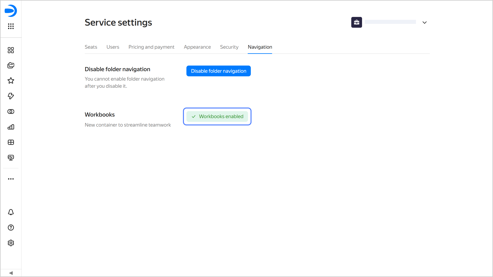



* To enable workbooks, a user must have the `{{ roles-datalens-admin }}` role. They can do this only if a {{ datalens-short-name }} instance is deployed at the [organization](../../../datalens/concepts/organizations.md) level.
* Only workbooks and collections are available in new {{ datalens-short-name }} instances.



To get started with workbooks:

1. In the left-hand panel, select  **Service settings**.
1. Select the **Navigation** tab.
1. Under **Workbooks**, click **Enable workbooks**.

   

   

   
