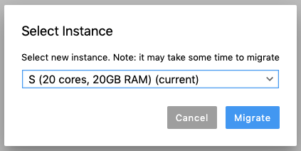

To change the VM configuration:

1. Click **Migrate to another instance** in the menu on the notebook tab.

1. Select the configuration.

    

1. Wait until the **State loaded** status appears next to the **Migrate to another instance** button. Changing the configuration takes 1 to 3 minutes: during this time, the VM starts for the project.



