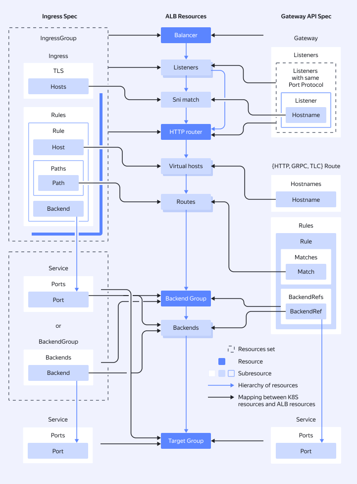

# Gwin controller for {{ managed-k8s-full-name }}

{{ alb-full-name }} introduces Gwin, a tool for creating and managing load balancers in [{{ managed-k8s-full-name }} clusters](../../../managed-kubernetes/concepts/index.md#kubernetes-cluster).

The Gwin controller installed in a cluster automatically deploys [L7 load balancers](../../../application-load-balancer/concepts/application-load-balancer.md) based on the configuration of the {{ k8s }} resources you created.

The controller supports the [Ingress](https://kubernetes.io/docs/concepts/services-networking/ingress/) and [Gateway API](https://gateway-api.sigs.k8s.io/) specifications. There is a [policy](../../../managed-kubernetes/alb-ref/gwin-policies.md) mechanism to configure additional {{ alb-name }} features beyond the {{ k8s }} specification. Such policies are managed by [CustomResourceDefinitions](https://kubernetes.io/docs/tasks/extend-kubernetes/custom-resources/custom-resource-definitions/) or annotations. Additional features include autoscaling, logging, and integration with [{{ sws-full-name }}](../../../smartwebsecurity/concepts/index.md).

Supported {{ k8s }} resources:



Here is how the Gwin controller works:



To learn how to install the Gwin controller, see [this guide](../../../managed-kubernetes/alb-ref/gwin-quickstart.md).

## Configuration examples

Below are two configuration examples: one using Gateway API resources and the other, Ingress resources. Both examples create an {{ alb-name }} that:

  * Automatically gets a dynamic public IP address.
  * Accepts HTTP traffic on port `80`.
  * Accepts HTTPS traffic on port `443` using a certificate in {{ certificate-manager-name }}.
  * Sends GET requests to a test service named `example-service`.



  - Gateway API {#gw}

      ```yaml
      apiVersion: gateway.networking.k8s.io/v1
      kind: Gateway
      metadata:
        name: example-gateway
        namespace: example-ns
      spec:
        gatewayClassName: gwin-default
        listeners:
          - name: http
            protocol: HTTP
            port: 80
            hostname: "example.com"
            allowedRoutes:
              namespaces:
                from: Same
          - name: https
            protocol: HTTPS
            port: 443
            hostname: "example.com"
            allowedRoutes:
              namespaces:
                from: Same
            tls:
              certificateRefs:
                - group: gwin.yandex.cloud
                  kind: YCCertificate
                  name: example-certificate
        addresses:
          - type: gwin.yandex.cloud/autoIPv4
            value: auto
      ---
      apiVersion: gateway.networking.k8s.io/v1
      kind: HTTPRoute
      metadata:
        name: example-redirect-httproute
        namespace: example-ns
      spec:
        hostnames:
          - "example.com"
        parentRefs:
          - name: example-gateway
            sectionName: http
        rules:
          - filters:
              - type: RequestRedirect
                requestRedirect:
                  scheme: https
                  statusCode: 301
      ---
      apiVersion: gateway.networking.k8s.io/v1
      kind: HTTPRoute
      metadata:
        name: example-httproute
        namespace: example-ns
      spec:
        hostnames:
          - "example.com"
        parentRefs:
          - name: example-gateway
            sectionName: https
        rules:
          - matches:
              - path:
                  value: /api
                  type: PathPrefix
                method: GET
            backendRefs:
              - kind: Service
                name: example-service
                port: 80
      ---
      apiVersion: gwin.yandex.cloud/v1
      kind: YCCertificate
      metadata:
        name: example-certificate
        namespace: example-ns
      spec:
        certificateRef:
          certificateID: "<certificate_ID>"
      ```

  - Ingress {#ingress}

      ```yaml
      apiVersion: networking.k8s.io/v1
      kind: Ingress
      metadata:
        name: example-ingress
        namespace: example-ns
        annotations:
          gwin.yandex.cloud/groupName: example
          gwin.yandex.cloud/externalIPv4Address: auto
          gwin.yandex.cloud/rules.allowedMethods: "GET"
      spec:
        ingressClassName: gwin-default
        rules:
          - host: example.com
            http:
              paths:
                - pathType: Prefix
                  path: "/api"
                  backend:
                    service:
                      name: example-service
                      port:
                        number: 80
        tls:
          - hosts:
              - example.com
            secretName: "yc-certmgr-cert-id-<certificate_ID>"
      ```



