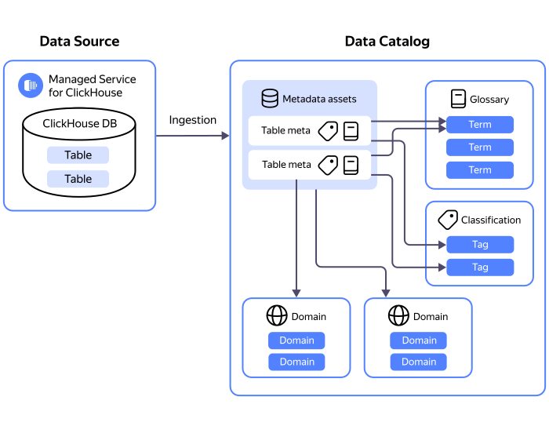

A metadata catalog serves as:

* Hub for collecting and storing metadata from various sources.
* Workspace for marking up metadata. 

You can upload metadata into a catalog using [sources and ingestions](#metadata-upload). The metadata will reside in a dedicated [data storage](#data-store), which brings together the metadata of sources from the same managed database cluster or the same custom database installation.

At the very basic level, you can use [domains and subdomains](#domains-and-subdomains), e.g., to arrange metadata by company departments. For a more complex markup, use these resources:

* [Classifications and tags](#classifications-and-tags)
* [Glossaries and terms](#glossaries-and-terms)

