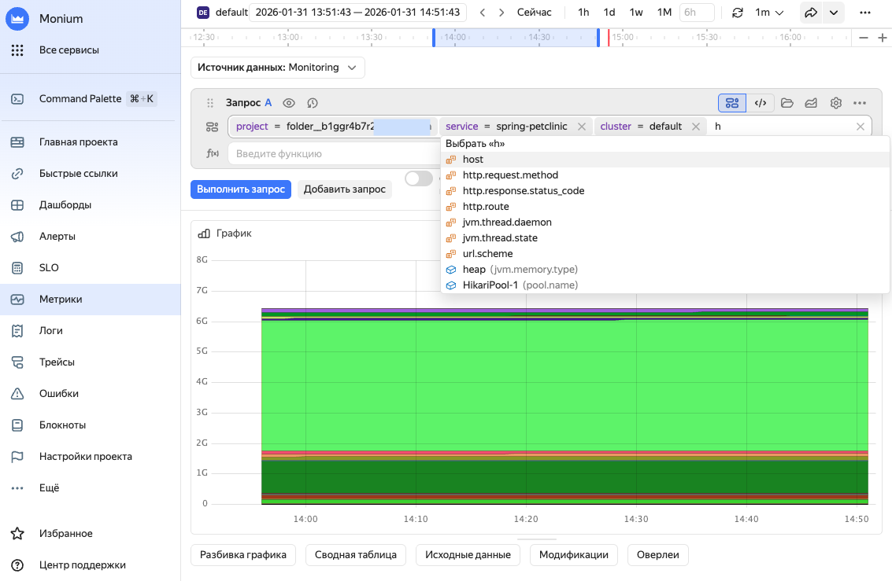
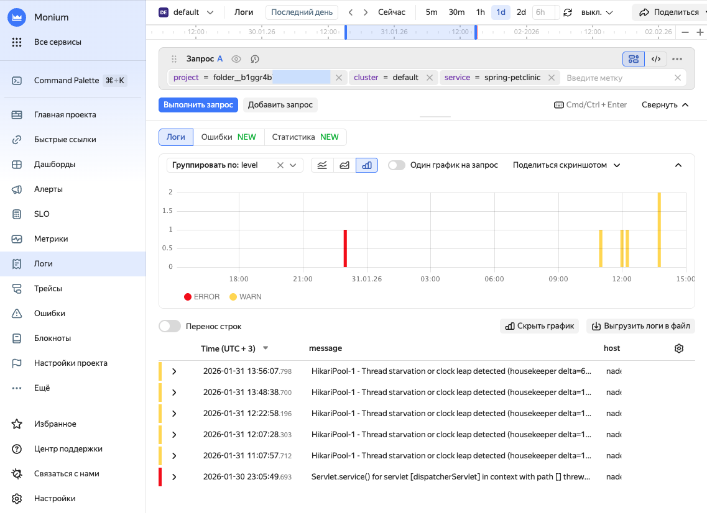
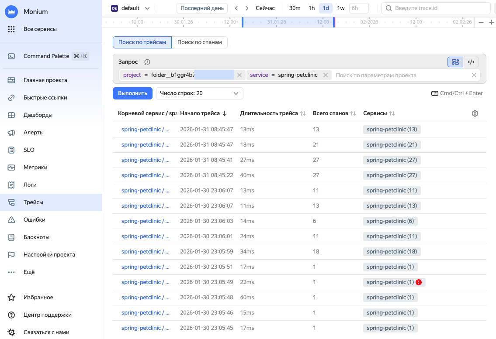



- {{ monium-name }} UI {#console}

  1. On the [{{ monium-name }}]({{ link-monium }}) home page, select **{{ ui-key.yacloud_monitoring.aside-navigation.menu-item.shards.title }}** on the left.
  1. In the list, select the shard with your service name.

     The shard name follows the `<project_name>_<cluster_name>_<service_name>` format, e.g., `folder__{{ folder-id-example }}_default_spring-petclinic`.
  
  1. To view a specific data type, on the left, select:

     * **{{ ui-key.yacloud_monitoring.aside-navigation.menu-item.explorer.title }}**.
       
       In the query string, select `project`, `cluster`, and `service` one by one and click **{{ ui-key.yacloud_monitoring.querystring.action.execute-query }}**.

       
       
       
       
       

       More on [metrics](../../monium/operations/metric/metric-explorer.md).

     * **{{ ui-key.yacloud_monitoring.aside-navigation.menu-item.logs.title }}**.
     
       In the query string, select `project`, `cluster`, and `service` one by one and click **{{ ui-key.yacloud_monitoring.querystring.action.execute-query }}**.

       
       
       
       
       

       More on [logs](../../monium/logs/quickstart.md).
     
     * **{{ ui-key.yacloud_monitoring.aside-navigation.menu-item.traces.title }}**.

       In the query string, select `project` and `service` one by one and click **Execute**.

       
       
       
       
       

       Learn more on [how to use traces](../../monium/traces/operations/traces-explorer.md).

