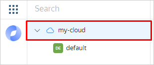

## Users with a Yandex account {#useraccount}

If your employees have Yandex accounts (for example, `{{ login-example }}`), they can use them to access the {{ yandex-cloud }} services enabled in your organization.

You can add a user to an organization via the management console or {{ org-full-name }}. When you add a user, an invitation to join the organization will be sent to the user's email address.

### Send an invitation {#send-invitation}



- {{ org-name }}

   1. [Log in to an account]({{ link-passport-login }}) that belongs to an organization administrator or owner.
   1. Go to [{{ org-full-name }}]({{ link-org-main }}).
   1. In the left-hand panel, select [{{ ui-key.yacloud_org.pages.users }}]({{ link-org-users }}) .
   1. In the top-right corner, click **{{ ui-key.yacloud_org.page.users.action.invite-users }}**.
   1. Enter the email addresses of the Yandex users you want to add to the organization, such as `{{ login-example }}`.
   1. Click **Send invitation**.

- {{ console-name }}

   1. [Log in]({{ link-passport-login }}) to the cloud administrator account.
   1. Log in to the [management console]({{ link-console-main }}).
   1. Select the appropriate cloud from the list on the left. For example:

      

   1. Go to the **{{ ui-key.yacloud.common.resource-acl.label_access-bindings }}** tab.
   1. In the top-right corner, click  and select **{{ ui-key.yacloud.common.resource-acl.button_invite-users }}**.
   1. Enter the email addresses of the Yandex users you want to add to the organization, such as `{{ login-example }}`.
   1. Click **Send invitation**.



The user will be able to log in to the organization after using the link and accepting the invitation. To access the [services](../../organization/concepts/manage-services.md#collaboration) enabled for the organization, the users you invited simply need to log in to their Yandex account.

You can delete or resend your invitation only via {{ org-name }}.

### Delete your invitation {#delete-invitation}

1. Under [{{ ui-key.yacloud_org.pages.users }}]({{ link-org-users }}) , go to **{{ ui-key.yacloud_org.page.users.label_tab-invitations }}** → **{{ ui-key.yacloud_org.entity.invitation.label_option-actual }}**.
1. Click  in the invitation line and select **{{ ui-key.yacloud_org.entity.invitation.label_row-action-delete }}**.

### Resend your invitation {#resend-invitation}

1. Under [{{ ui-key.yacloud_org.pages.users }}]({{ link-org-users }}) , go to **{{ ui-key.yacloud_org.page.users.label_tab-invitations }}** → **{{ ui-key.yacloud_org.entity.invitation.label_option-actual }}**.
1. Click  in the invitation line and select **{{ ui-key.yacloud_org.entity.invitation.label_row-action-resend }}**.






