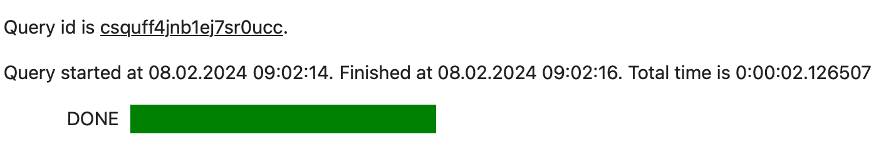

## Query templating using Mustache syntax {#templating}

You can use query templates shared between {{ jlab }} and {{ yq-name }} to work with queries and perform routine operations without writing any code. For this, {{ yq-name }} comes with built-in [Mustache syntax](https://mustache.github.io) support. You can use it to write queries, placing all template keywords and directives inside double curly brackets (`{{}}`). You can use Mustache syntax either with [Jinja2](https://jinja.palletsprojects.com/en/3.1.x/) or with the built-in Mustache interpreter.

Built-in mustache templates {{ `yq-name` }} allow you to insert {{ jlab }} runtime variables into SQL queries. Such variables will be automatically converted into required {{ yq-name }} data structures. Here is an example:

```python
myQuery = "select * from Departments"
%yq not_var{{myQuery}}
```

The system will interpret the `not_var{{myQuery}}` Mustache string as the name of the variable containing the required text and will send `select * from Departments` to {{ yq-name }} for execution.

Mustache templates streamline {{ jlab }} and {{ yq-name }} integration. Suppose you have a Python list `lst=["Academy", "Physics"]` containing the names of departments whose data you want to process. If {{ yq-name }} did not support Mustache syntax, you would need to convert the Python list into a string first and then insert it into your SQL query. Query example:

```python
var lstStr = ",".join(lst)
sqlQuery = f'select "Academy" in ListCreate({lstStr});
%yq not_var{{sqlQuery}}
```

This example showcases how working with complex data types requires you to understand the specifics of {{ yq-name }} SQL syntax. With Mustache syntax, the query becomes simpler:

```sql
%yq select "Academy" in not_var{{lst}}
```

Here, the system will automatically recognize `lst` as a Python list, insert the SQL fragment required for list processing, and send the following query text to {{ yq-name }}:

```sql
%yq select "Academy" in ListCreate("Academy", "Physics") as lst
```

### Jinja2 {#jinja2}

We recommend using the built-in Mustache syntax for routine tasks in {{ jlab }} and {{ yq-name }}. For advanced templating, use Jinja2.

To install Jinja2, run this command:

```python
%pip install Jinja2
```

Example of using a Jinja template with the `for` loop:

```python

    command = "select * from users where name='not_var{{ user }}'"

```

You can also use Jinja templates for data processing operations. In the following example, the operations performed on the department name vary based on the student’s department:

```python

    not_var{{ student.department|upper }}

    not_var{{ student.department|capitalize }}

```

To make Jinja convert data according to {{ yq-name }} rules, use the `to_yq` filter. Here is how the Python list from the previous example (`lst=["Academy", "Physics"]`) looks in a Jinja template:

```sql
%%yq --jinja2
select "Academy" in not_var{{lst|to_yq}}
```

To disable templating, use the `--no-var-expansion` argument:

```sql
%%yq --no-var-expansion
...
```

### Built-in Mustache templates {#embedded_mustache}

Built-in mustache templates are enabled by default in {{ yq-full-name }} to streamline basic operations with {{ jlab }} variables:

```python
lst=["Academy", "Physics"]
```

```sql
%yq select "Academy" in not_var{{lst}}
```

#### Using Pandas DataFrame variables {#capture-dataframe}

Here is an example of using `yandex_query_magic` and Mustache syntax with [Pandas DataFrame](https://pandas.pydata.org/docs/reference/api/pandas.DataFrame.html):

1. Define a variable in {{ jlab }}:

    ```python
    df = pandas.DataFrame({'_float': [1.0],
                        '_int': [1],
                        '_datetime': [pd.Timestamp('20180310')],
                        '_string': ['foo']})
    ```

You can use the `df` variable when querying {{ yq-full-name }}. During query execution, the system uses the `df` value to create a temporary table also named `df`. This table can then be used within the {{ yq-full-name }} query.

1. Retrieve the data:

    ```sql
    %%yq
    SELECT
        *
    FROM mytable
    INNER JOIN not_var{{df}}
        ON mytable.id=df._int
    ```

Pandas to {{ yq-name }} type mapping:

| Pandas type | YQL type | Note |
|-----|-----|-----|
| int64 | Int64 | Exceeding the `int64` limit will result in a query error. |
| float64 | Double ||
| datetime64[ns] | Timestamp | Microsecond precision. Entering nanoseconds [in the `nanosecond` field](https://pandas.pydata.org/docs/user_guide/timeseries.html#time-date-components) will raise an exception. |
| str | String ||

#### Using Python dict variables {#capture-dict}

Here is an example of using `yandex_query_magic` with Mustache syntax and a Python dict:

1. Define a variable in {{ jlab }}:

    ```python
    dct = {"a": "1", "b": "2", "c": "test", "d": "4"}
    ```

    Now you can use the `dct` variable in {{ yq-name }} queries. At query runtime, the system will convert `dct` into the relevant [YQL Dict]({{ ydb.docs }}/yql/reference/builtins/dict) object:

    | Key | Value |
    |---|---|
    | a | "1" |
    | b | "2" |
    | c | "test" |
    | d | "4" |

1. Retrieve the data:

    ```sql
    %%yq
    SELECT "a" in not_var{{dct}}
    ```

Python dict to {{ yq-name }} type mapping:

| Python type | YQL type | Note |
|-----|-----|-----|
| int | Int64 | Exceeding the int64 limit will result in a query error. |
| float | Double ||
| datetime | Timestamp ||
| str | String ||

Another way to convert a dictionary to a [Pandas DataFrame](#capture-dataframe) is by using a constructor:

```python
df = pandas.DataFrame(dct)
```

#### Using Python list variables {#capture-list}

Here is an example of using `yandex_query_magic` with Mustache syntax and a Python dict:

1. Define a variable in {{ jlab }}:

    ```python
    lst = [1,2,3]
    ```

    Now you can use the `lst` variable in {{ yq-name }} queries. At query runtime, the system will convert `lst` into the relevant [YQL Dict]({{ ydb.docs }}/yql/reference/types/containers) object:

1. Retrieve the data:

    ```sql
    %%yq
    SELECT 1 IN not_var{{lst}}
    ```

Python list to {{ yq-name }} type mapping:

| Python type | YQL type | Note |
|-----|-----|-----|
| int | Int64 | Exceeding the int64 limit will result in a query error. |
| float | Double ||
| datetime | Timestamp ||
| str | String ||

Another way to convert a dictionary to a [Pandas DataFrame](#capture-dataframe) is by using a constructor:

```python
df = pandas.DataFrame(lst,
                      columns =['column1', 'column2', 'column3'])
```

### Jinja templates {#jinja}

Jinja templates make it easy to build SQL queries, allowing you to automatically insert search conditions and other data. This way, you don’t need to write each query from scratch. It can help you streamline your workflow, avoid mistakes, and create more readable code.

You can also use Jinja templates to automate building queries with repetitive parts. For example, you can use template loops to write multiple queries that check different values from a list. This adds even more flexibility, speeding up the process of writing complex queries when you need to handle large amounts of data.

The steps below explain how to filter {{ yq-full-name }} data using a Python variable.

1. Define a variable in {{ jlab }}:

    ```python
    name = "John"
    ```

1. Before you run the following code in a {{ jlab }} cell, set the `jinja2` flag. It will tell the system to treat SQL queries as [Jinja2 templates](https://jinja.palletsprojects.com/en/):

    ```sql
    %%yq <other_parameters> --jinja2

    SELECT "not_var{{name}}"
    ```

    Settings:

    * `--jinja2`: Enables [Jinja](https://jinja.palletsprojects.com/) template rendering for the query text. To use this flag, you need to install the [Jinja2](https://pypi.org/project/Jinja2/) package (`%pip install Jinja2`).

#### `to_yq` filter {#to_yq}

Jinja2 is a general-purpose templating engine. When handling variables, it uses a standard string representation of data types.

For example, if you have a Python list `lst=["Academy", "Physics"]`, here is how you can use it in a Jinja template:

```sql
%%yq --jinja2
select "Academy" in not_var{{lst}}
```

Running this code will result in the `Unexpected token '['` error. This error occurs because Jinja converts the `lst` variable to the `["Academy", "Physics"]` string using Python rules and ignores {{ yq-full-name }}-SQL specifics.

To tell Jinja that it should follow {{ yq-full-name }} rules, use the `to_yq` filter. In this case, the previous query in the Jinja syntax will look like this:

```sql
%%yq --jinja2
select "Academy" in not_var{{lst|to_yq}}
```

The `to_yq` Jinja filter converts data to the {{ yq-full-name }} syntax in the exact same way as [built-in Mustache templates](#embedded_mustache).

## Capturing command results {#capture-command-result}

You can capture the output of a line magic command using an assignment:

```
varname = %yq <query>
```

To capture a cell magic command’s output, start the query with the target variable name and the `<<` operator:

```
%%yq
varname << <query>
```

From there, you can treat the result as any other {{ jlab }} variable.

For example, let’s use a cell magic to capture the result in the `output` variable:

```sql
output = %yq SELECT 1 as column1
```

And here we use a line magic to capture the result in the `output2` variable:

```sql
%%yq
output2 << SELECT 'Two' as column2, 3 as column3
```

Now, you can use these variables just like any other IPython variable. For example, you can print them:

```python
output
```

By default, `%yq` and `%%yq` commands return a [Pandas DataFrame](https://pandas.pydata.org/docs/reference/api/pandas.DataFrame.html). Its columns match SQL column names, and its rows contain query results. You can disable `Pandas DataFrame` conversion using the [--raw-results](#usage) argument.

In our example, the `output` variable has the following structure:

||**column1**|
|---|----|
|**0**|1|

The `output2` variable has the following structure:

||**column2**|**column3**|
|---|----|-----|
|**0**|Two|3|

If your query does not return any results (for example, it is `insert into table select * from another_table`), the return value will be `None`. If a query returns multiple results, they will be presented as a `list`.

When you run a query, `yandex_query_magic` outputs extra details, e.g., query ID, start time, and query duration:



To hide the progress output for a cell, you can use the `%%capture` command.

```
%%capture
%%yq
<query>
```

This will suppress progress output in the console.
