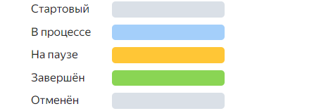

By default, issue bars on the chart are colored according to the issue status types set in the [workflow editor](../../tracker/manager/workflow.md).

To select a different color scheme:

1. Above the timeline on the right, click &nbsp;**Chart settings**.
1. Under **{{ ui-key.startrek-backend.fields.issue.paletteColor }}**, you can choose an appropriate color scheme:

   

   - Setting a color manually

     This option allows you to set issue colors right on the chart.

     1. Select **manual**.
     1. Click **Apply**.

     Select an issue from the list to the left of the chart and click  **Issue actions menu**. This will open a palette where you can set the issue color.

     

   - Setting colors based on issue parameters

     This option will be of use if you need to differentiate issues by a certain parameter, such as a queue or tag.

     1. Select **by task parameters**.
     1. Specify the parameter whose values you want to set colors for.
     1. Click **Apply**.

   - Monochrome

     All issue bars on the chart will be blue.

     1. Select **monochrome**.
     1. Click **Apply**.

   
