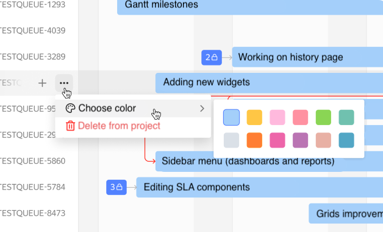

By default, all issue bars on the chart are blue. To set up different colors for issues:

1. Above the timeline on the right, click &nbsp;**{{ ui-key.startrek.ui_components_Gantt.timeline-config }}**.
1. Under **{{ ui-key.startrek-backend.fields.issue.paletteColor }}**, you can set a color manually right on the chart or set up colors depending on the issue parameters.

   

   - Setting a color manually

      1. Select **{{ ui-key.startrek.ui_components_Gantt.color-type-by-manual }}**.
      1. Click **{{ ui-key.startrek.blocks-desktop_b-filter.apply }}**.
      1. Select the appropriate issue from the list to the left of the chart and click  **{{ ui-key.startrek.ui_components_Gantt_IssueActionsCell.issue-action-menu-title }}**.
      1. Select a color.

      

   - Setting colors based on issue parameters

      1. Select **{{ ui-key.startrek.ui_components_Gantt.color-type-by-parameter }}**.
      1. Specify the parameter whose values you want to set colors for.
      1. Click **{{ ui-key.startrek.blocks-desktop_b-filter.apply }}**.

   



If you kept the default color, you will not be able to set colors in  **{{ ui-key.startrek.ui_components_Gantt_IssueActionsCell.issue-action-menu-title }}**.


