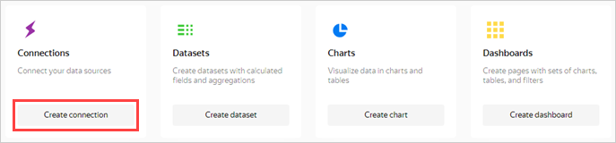

# Visualizing data from AppMetrica

The application added to [AppMetrica](https://appmetrica.yandex.com) will be used as the data source. You can view a list of applications available to you under [Applications](https://appmetrica.yandex.com/application/list).

If you don't have any apps available, then before performing this scenario, [add an app](https://appmetrica.yandex.com/docs/quick-start/concepts/quick-start.html) or use the standard **AppMetrica dashboard**.

To visualize data:

1. [Before you start](#before-you-begin).
1. [Create a connection and standard dashboard](#create-dashboard).
1. [Edit the standard dashboard](#edit-dashboard).

## Before you start {#before-you-begin}



## Create a connection and a standard dashboard {#create-dashboard}



This step is available to users who have an app in AppMetrica. If you don't have any apps, open the standard **AppMetrica dashboard** and go to the [next step](#edit-dashboard).



1. Go to [{{ datalens-short-name }}](https://datalens.yandex.com) and click **Create connection**.

    

1. Select the **AppMetrica** connection.

    

1. Enter a name for the connection: `My AppMetrica`, then click **Get token**.

    

    If this is your first connection to an AppMetrica app, grant the necessary permissions to the service.

1. Select an app from the drop-down list.

    

1. Specify the connection settings:

    
    1. Set the data accuracy (sampling rate). You can change accuracy after you create the connection.
    1. Select the **Direct access** connection type.
    1. Enable **Automatically create a dashboard on this connection**.

1. In the upper-right corner, click **Create**.

    When the connection is created, a folder containing a dashboard and a set of datasets and charts opens.

## Edit the standard dashboard {#edit-dashboard}



If you don't have an app in AppMetrica and you skipped the previous step, use the **AppMetrica dashboard**.



You can edit the standard [dashboard](../../datalens/concepts/dashboard.md) however you want. For example, you can delete a chart, change its size, or change the visualization type.

1. Open the dashboard.

1. Click **Edit** in the upper-right corner.

    

1. To delete the **Click dynamics** widget, click  in the upper-right corner.

    

1. To change the size of the **Installation dynamics** widget, drag it by the lower-right corner.

1. Click **Save** in the upper-right corner to save the dashboard.

     

You can edit any chart on the dashboard. For example, change the visualization type for the **Ad networks** chart from the **Attracting users** section.

