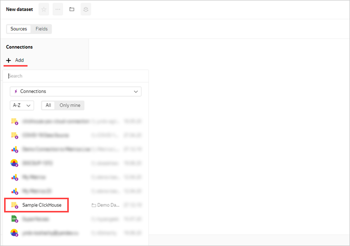
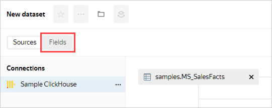
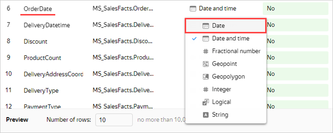
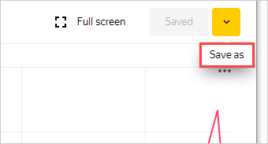
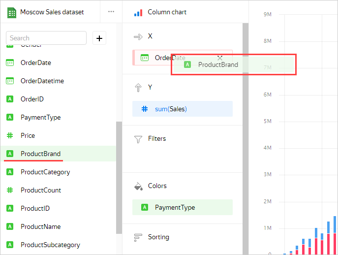
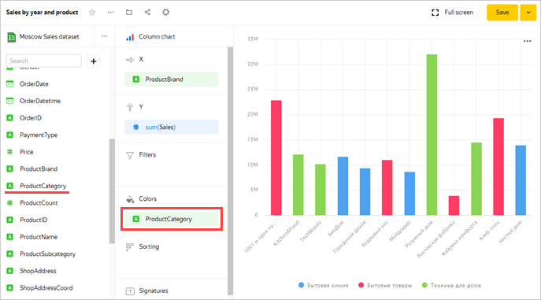
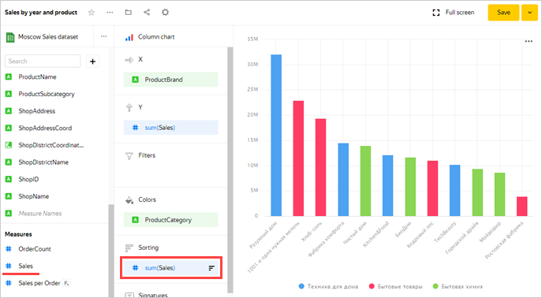
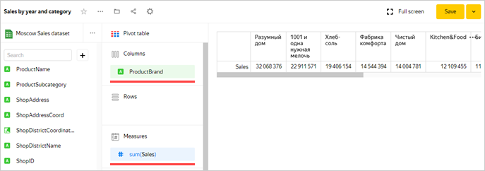
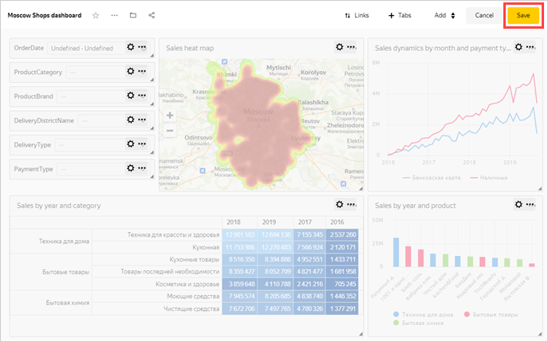

# Visualizing data from a ClickHouse database

As a data source, we'll use a demo ClickHouse database on sales in a Moscow chain of stores.
The connection to this database is automatically created when a {{ datalens-short-name }} instance is created.

In this example, {{ datalens-short-name }} is used to visualize:

* Sales dynamics by day and month.
* Sales by product categories.
* Order heat map.

A demo **Sample ClickHouse** connection is used.

To visualize and analyze the data, [make sure you have a ready-to-use cloud](#before-you-begin) and follow these steps:

1. [Define the data source for the dataset](data-from-ch-visualization.md#step1).
1. [Configure the dataset fields](data-from-ch-visualization.md#step2).
1. [Create a line chart](data-from-ch-visualization.md#step3).
1. [Create a column chart](data-from-ch-visualization.md#step4).
1. [Create a pivot table chart](data-from-ch-visualization.md#step5).
1. [Create a heat map chart](data-from-ch-visualization.md#step6).
1. [Create a dashboard](data-from-ch-visualization.md#step7).
1. [Add the charts to the dashboard](data-from-ch-visualization.md#step8).
1. [Add selectors to the dashboard](data-from-ch-visualization.md#step9).

Create a [connection](../../datalens/concepts/connection.md) to the ClickHouse database with the table.

## Before you start {#before-you-begin}



## Step 1. Define the data source for the dataset {#step1}

Create a [dataset](../../datalens/concepts/dataset/index.md) using the [connection](../../datalens/concepts/connection.md) **Sample ClickHouse** created from a ClickHouse database.

1. Go to [{{ datalens-short-name }}](https://datalens.yandex.com).

1. Click **Create dataset**.

    

1. Click **Add** under **Connections** on the selection panel. Select the **Sample ClickHouse** connection.

    

1. Drag the **MS_SalesFacts** table to the workspace.

    

1. Drag the **MS_Clients** table to the workspace. The tables are automatically linked.

    

1. To check the link, click the link icon between the tables.

    

1. Tables are linked by the **ClientID** field. If needed, you can modify or expand the link by specifying another pair of fields. To close the link settings window, click the cross button or anywhere outside the window.

    

1. Drag the **MS_Products** table to the workspace. The table is automatically linked to the left (root) table **MS_SalesFacts**.

    

1. Drag the **MS_Shops** table to the workspace. The table is automatically linked to the left (root) table **MS_SalesFacts**.

    

## Step 2. Configure the dataset fields {#step2}

1. Go to the **Fields** tab.

    

1. Delete the duplicate fields left over from joining the tables: **ClientID (1)**, **ProductID (1)**, and **ShopID (1)**.

    

1. Create an order date field named **OrderDate**.

    1. Duplicate the **OrderDatetime** field.

        

    1. Rename the **OrderDatetime (1)** duplicate field to **OrderDate**: click the row name, delete the current name, and enter the new one.

       

    1. Change the data type from **Date and time** to **Date**.

        

1. For the **ShopDistrictCoordinates** field, change the data type to **Geopolygon**.

1. For the **DeliveryDistrictCoordinates** field, change the data type to **Geopolygon**.

1. For the **DeliveryAddressCoord** field, change the data type to **Geopoint**.

1. In the **Aggregation** column, select **Sum** for the **Sales** field.

    

    The aggregation field changes color to blue: **Sales** is now a measure.

    

1. Create a measure for the number of orders.

    1. Duplicate the **OrderID** field.

    1. Rename the **OrderID (1)** duplicate field to **OrderCount**.

    1. Change the aggregation type to **Number of unique**.

    

1. Create a calculated field for the average sales amount per order.

    1. In the upper-right corner, click **Add field**.

    1. In the **Name** field, specify **Sales per Order**.

    1. In the column to the left, click on the **Sales** field.

    1. Enter a `/`.

    1. In the column to the left, click the **OrderCount** field.

    1. Click **Create**.

        

1. Click **Save** in the upper-right corner to save the dataset.

    

1. Enter a name for the dataset: **Moscow Sales dataset**, then click **Create**.

1. When the dataset is saved, click **Create chart**.

    

## Step 3. Create a line chart {#step3}

To visualize sales dynamics by month, create a [chart](../../datalens/concepts/chart.md): line chart.

1. For the visualization type, choose **Line chart**.

    

1. Add the sales date to the chart. Drag the **OrderDate** field from the **Dimensions** section to the **X** section.

1. Add a sales measure to the chart. To do this, drag the **Sales** field from the **Measures** section to the **Y** section.

1. Add the delivery type to the chart. To do this, drag the **PaymentType** field from the **Dimensions** section to the **Colors** section.

    

1. Display the chart by month.
    1. Click the calendar icon next to the **OrderDate** field in the **X** section.
    1. In the drop-down list of grouping options, select **Month** under **Rounding**.
    1. Click **Apply**.

     

1. Save the chart.

    1. Click **Save** in the upper-right corner to save the chart.

       

    1. In the window that opens, enter a name for the chart: **Sales dynamics by month and payment type**, and click **Save**.

## Step 4. Create a column chart {#step4}

To visualize sales by brands and product categories, create a [chart](../../datalens/concepts/chart.md): column chart.

1. Copy the chart from the previous step.

    1. Click the down arrow next to the **Save** button in the upper-right corner.

    1. Choose **Save as**.

        

    1. In the window that opens, enter the name **Sales by brand and category** for the new chart and click **Save**.

1. For the visualization type, choose **Column chart**.

    

1. The **OrderDate**, **Sales**, and **PaymentType** fields are copied automatically to the **X**, **Y**, and **Colors** sections, respectively.

1. Replace the months with brands on the X-axis. From the **Dimensions** section, drag the **ProductBrand** field to the **X** section and hold it over the **OrderDate** field until it turns red.

    

1. Replace payment types for product categories in Colors. Drag **ProductCategory** from the **Dimensions** section to the **X** section and hold it over the **PaymentType** field until it turns red.

    

1. Sort the chart in descending order of sales measure. Drag the **Sales** field from the **Measures** section to the **Sorting** section.

    

1. Save the chart.

## Step 5. Create a pivot table chart {#step5}

To visualize sales in terms of products and time, create a [chart](../../datalens/concepts/chart.md): pivot table.

1. Copy the chart from the previous step.
    1. Click the down arrow next to the **Save** button in the upper-right corner.
    1. Click **Save as**.
    1. In the window that opens, enter the name **Sales by year and product** for the new chart.
    1. Click **Ready**.

1. Choose the **Pivot table** visualization type.

    

1. The **ProductBrand** and **Sales** fields are automatically copied to the **Columns** and **Measures** sections, respectively.

    

1. Remove **ProductBrand** from the table.

1. Add the order date to the table. To do this, drag the **OrderDate** field from the **Dimensions** section to the **Columns** section.

1. Change the display format in the **OrderDate** field to years.

    1. Click the calendar icon next to the **OrderDate** field in the **Columns** section.

    1. In the drop-down list of grouping options, select **Year** under **Date part**.

    1. Click **Apply**.

        

1. Add the product category and subcategory to the table. To do this, drag the **ProductCategory** and **ProductSubcategory** fields from the **Dimensions** section to the **Rows** section.

    

1. Change the color of the sales measure in the table. To do this, drag the **Sales** field from the **Measures** section to the **Colors** section.

    

1. Save the chart.

## Step 6. Create a heat map {#step6}

To visualize the density of orders on the Moscow map, create a [chart](../../datalens/concepts/chart.md): heat map.

1. Copy the chart from the previous step.
    1. Click the icon next to the **Save** button in the upper-right corner and select **Save as**.
    1. In the window that opens, enter the name **Sales heat map** for the new chart.
    1. Click **Ready**.

1. Select the **Map** visualization type.

    

1. Delete the **Sales** field from the **Colors** section.

1. Select the **Points (heat map)** layer type.

1. Add the delivery point coordinates to the map. To do this, drag the **DeliveryAddressCoord** field from the **Dimensions** section to the **Points (heat map)** section.

    

1. Save the chart.

## Step 7. Create a dashboard {#step7}

Create a [Dashboard](../../datalens/concepts/dashboard.md) to add your charts to.

1. Go to the DataLens homepage.

1. Click **Create dashboard**.

    

1. Enter the name **Moscow Shops dashboard** for the dashboard and click **Create**.

## Step 8. Add the charts to the dashboard {#step8}

1. The first time you open the dashboard after saving, it opens in edit mode. If you open it later, click **Edit** in the upper-right corner.

    

1. Click **Add** and select **Chart**.

    

1. In the window that opens, click **Select**.

1. Select the chart **Sales dynamics by month and payment type**. This automatically fills in the **Title** field with the name of the selected chart.

1. Click **Add**.

    

1. Similarly, add the following charts:
    * **Sales by brand and category**
    * **Sales by year and product**
    * **Sales heat map**

1. Position the charts on the dashboard however you like.

    

## Step 9. Add selectors to the dashboard {#step9}

Add [selectors](../../datalens/concepts/dashboard.md#selector) to filter the charts by date, Moscow districts, products, and customer statuses.

1. Click **Add**.

1. Choose **Selector**.

    

1. Add the calendar selector for the order date.
    1. Select the **Moscow Sales dataset**.
    1. Select the **OrderDate** field.
    1. This automatically fills in **Title** with the name of the selected field. Click the **Show** checkbox next to the selector title.
    1. Select the **Calendar** type.
    1. Enable **Range**.
    1. Click **Add**.

    

1. Add a product category selector.
    1. Select the **Moscow Sales dataset**.
    1. Select the **ProductCategory** field.
    1. This automatically fills in **Title** with the name of the selected field. Click the **Show** checkbox next to the selector title.
    1. Enable the **Multiple choice** option.
    1. Click **Add**.

    

1. Similarly, add selectors for the following field:
    * **ProductBrand**
    * **DeliveryDistrictName**
    * **DeliveryType**
    * **PaymentType**

1. Position the selectors on the dashboard however you like.

1. Save the dashboard.

    

1. Your dashboard is ready. Now you can filter charts using selectors.

    
