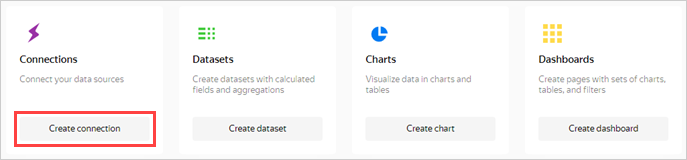
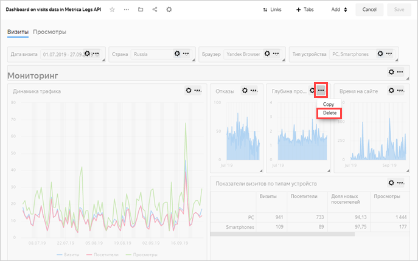
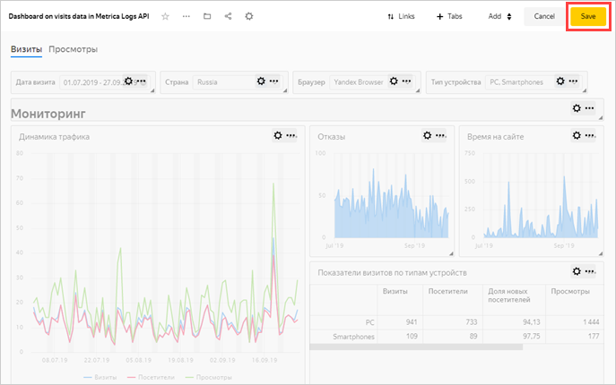
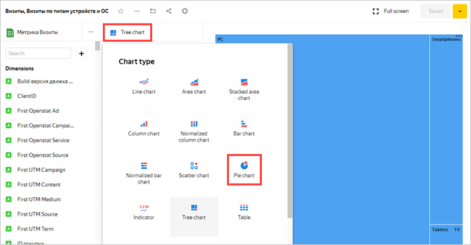
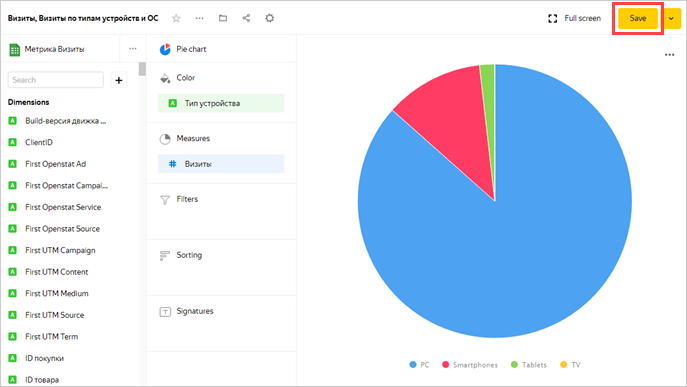

# Visualizing data from Yandex.Metrica Logs API

**Logs API** technology lets you get non-aggregated Yandex.Metrica data, process it, and use it in analytical tasks.



To perform this scenario, you need have access to a Yandex.Metrica tag and a Clickhouse database in Yandex.Cloud.



See the list of available tags at [metrika.yandex.com/list](https://metrika.yandex.com/list).

You can find instructions for creating a ClickHouse cluster in the [Managed Service for ClickHouse documentation](../../managed-clickhouse/operations/cluster-create.md).

To visualize the data, follow these steps:

1. [Before you start](#before-you-begin).
1. [Create a connection and a standard dashboard](#step1).
1. [Edit the standard dashboard](#step2).
1. [Edit the chart](#step3).

## Before you start {#before-you-begin}



## Step 1. Create a connection and a standard dashboard {#step1}

1. Go to the [interface{{ datalens-short-name }}](https://datalens.yandex.com).

1. Click **Create connection**.

    

1. Select **Metriсa**.

    

1. Enter a name for the connection: **My Metrica Logs API**.

1. Click **Get token**.

    

1. In the window that opens, grant the necessary permissions to the service.

1. From the drop-down list under the word **Tag**, select the desired tag.

    

1. Select the **Via Logs API** connection type.

    

1. Fill in the upload parameters and access credentials for the target database.

    1. In the **Tag source** field, choose **Sessions**.

    1. In the **Upload from** field, select from which date you wish to upload data. For example, **01.07.2019**.

    1. Select the **Regular** option. The data will be updated automatically every day.

    1. In the **Hostname** field, specify the ClickHouse database host. You can get your database access credentials on the ClickHouse cluster connection page in the console.

        

        The Metrica Logs API connection can only access ClickHouse databases deployed in Yandex.Cloud.

        

    1. In the **Port** field, specify the default database port **8443**.

    1. Specify the **database name**, **username**, and **password**.

    1. Click **Check connection** to verify that your database access credentials are correct. A green check mark next to the button indicates that the connection was established successfully.

    1. Enable **Automatically create a dashboard on this connection**.

    

1. Click **Create connection**.

    

     

     It can take from several minutes to dozens of hours to upload tag data from Yandex.Metrica to the ClickHouse database depending on the amount of data and the upload start date.

     

1. When the connection is created, a folder containing the datasets, charts, and dashboard opens. Go to **Dashboard with Yandex.Metrica data**.

    

  If you see errors on the charts when opening the dashboard, it means that the data isn't finish loading yet. Resume the scenario in half an hour.

## Step 2. Edit the standard dashboard {#step2}

You can edit the standard [dashboard](../../datalens/concepts/dashboard.md) however you want. For example, you can delete a chart you no longer need.

1. Open the dashboard above your tag data. Try different ways of filtering your charts.

    

1. Click **Edit** in the upper-right corner.

    

1. Delete the **Page depth** chart. To do this, click  in the upper-right corner of the chart, then click **Delete**.

    

1. Position the **Bounce rate** and **Time on site** charts so that they fill in the empty space left after deleting the chart in the previous step. You can drag the charts by clicking on them. You can resize charts (expand or shrink) using the triangle in the lower-right corner.

    

1. Click **Save** in the upper-right corner to save the dashboard.

     

## Step 3. Edit the chart {step3}

You can edit any chart on the dashboard. For example, change the visualization type for the **Sessions by device type and OS** chart from the **Technologies** section.

1. Click  in the upper-right corner of the **Sessions by device type and OS** chart.

1. Select **Edit**.

    

1. In the second column of the window that opens, click **Tree chart** and choose a different chart type: **Pie chart**.

    

1. Click **Save** in the upper-right corner to save the chart.

    

1. Close the chart editing tab and go back to the dashboard window.

1. Update the dashboard and make sure that the chart changed in the **Technologies** section.

    

