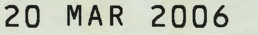

The image must contain only one line of text and the text height must be at least 80% of the image height, otherwise the recognition results of the `line` model may be unpredictable. Example of an appropriate image:

