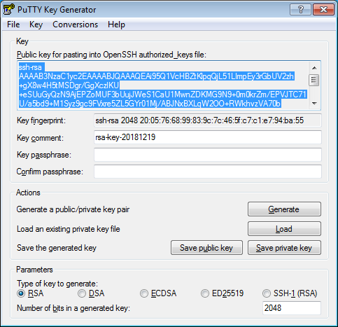

To connect to a virtual machine over [SSH](../glossary/ssh-keygen.md)SSH, you need a key pair: the public key is put on the virtual machine, while the private key is stored on the user device. This method is more secure than connecting with a username and password.



Cisco Cloud Services Router (CSR) 1000v only supports keys generated using the RSA algorithm.

To create a key pair:



- Linux/macOS

   1. Open the terminal.
   1. Use the `ssh-keygen` command to create a new key:

      ```
      ssh-keygen -t rsa -b 2048
      ```

      After the command runs, you will be asked to specify the names of files where the keys will be saved and enter the password for the private key. The default name is `id_rsa`. Keys are created in the `~/.ssh` directory.

      The public part of the key will be saved in the `<key_name>.pub` file.

- Windows 10

   1. Run `cmd.exe` or `powershell.exe`.
   1. Use the `ssh-keygen` command to create a new key:

      ```
      ssh-keygen -t rsa -b 2048
      ```

      After the command runs, you will be asked to specify the names of files where the keys will be saved and enter the password for the private key. The default name is `id_rsa`. The keys are created in `C:\Users\<username>\.ssh\` or `C:\Users\<username>\` depending on the command-line interface.

      The public part of the key will be saved in a file with the name `<key name>.pub`.


- Windows 7/8

   To create keys for Windows, use the PuTTY application.

   1. [Download](https://www.putty.org) and install PuTTY.
   1. Make sure that the directory where you installed PuTTY is included in `PATH`:
      1. Right-click on **My computer**. Click **Properties**.
      1. In the window that opens, select **Additional system parameters**, then **Environment variables** (located in the lower part of the window).
      1. Under **System variables**, find `PATH` and click **Edit**.
      1. In the **Variable value** field, append the path to the directory where you installed PuTTY.
   1. Launch the PuTTYgen app.
   1. Select **RSA** for the type of pair to generate and set the length to 2048. Click **Generate** and move the cursor in the field above it until key creation is complete.

      

   1. In **Key passphrase**, enter a strong password. Enter it again in the field below.
   1. Click **Save private** key and save the private key. Never share it with anyone and do not tell anyone the passphrase for it.
   1. Save the key to a text file. To do this, copy the public key from the text field to a text file with the name `id_rsa.pub`. Please note that the key must be written as a **single line** (no returns or line breaks).


