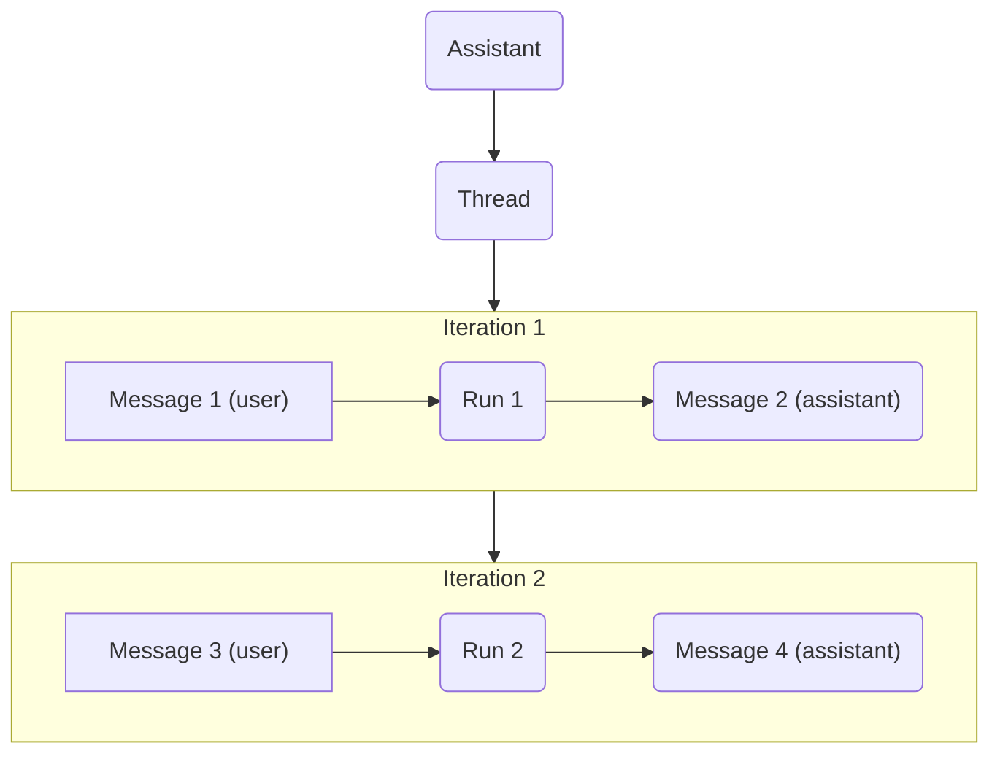

```mermaid
flowchart TB
 subgraph I1["Iteration 1"]
    direction LR
        U1["Message 1 (user)"] -->
        R1("Run 1") -->
        A1("Message 2 (assistant)")        
  end
 subgraph I2["Iteration 2"]
    direction LR
        U2["Message 3 (user)"] -->
        R2("Run 2") -->
        A2("Message 4 (assistant)")  
  end
    A("Assistant") --> T("Thread")
    T --> I1
    I1 --> I2
```