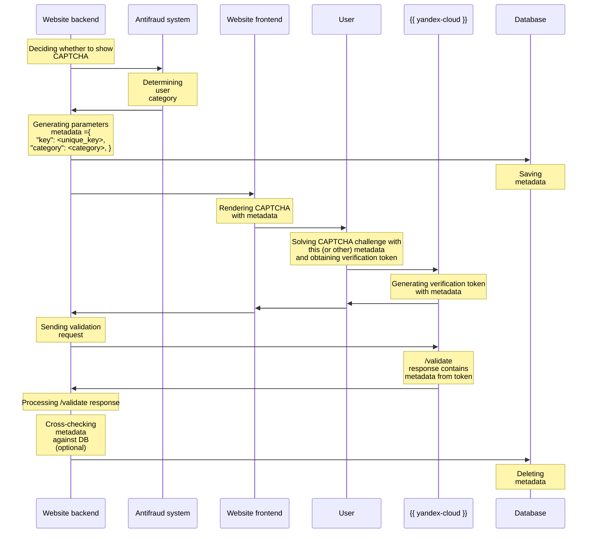

```mermaid
sequenceDiagram
    %% Participants
    participant Backend as Website backend
    participant Antifraud as Antifraud system
    participant Frontend as Website frontend
    participant User as User
    participant CaptchaBackend as {{ yandex-cloud }}
    participant DB as Database

    %% Process flow
    Note over Backend: Deciding whether to show<br/>CAPTCHA
    Backend->>Antifraud:  
    Note over Antifraud: Determining<br/>user<br/>category
    Antifraud->>Backend:  

    Note over Backend: Generating parameters<br/>metadata ={<br/>"key": <unique_key>,<br/>"category": <category>, }
    
    Backend->>DB:  
    Note over DB: Saving<br/>metadata

    Backend->>Frontend:  
    Note over Frontend: Rendering CAPTCHA<br/>with metadata
    
    Frontend->>User:  
    
    Note over User: Solving CAPTCHA challenge with<br/>this (or other) metadata <br/>and obtaining verification token
    User->>CaptchaBackend:  
    
    Note over CaptchaBackend: Generating verification token<br/> with metadata
    CaptchaBackend->>User:  

    User->>Frontend:  
    Frontend->>Backend:  
    
    Note over Backend: Sending validation<br/>request

    Backend->>CaptchaBackend:  
    Note over CaptchaBackend: /validate<br/>response contains<br/> metadata from token
    CaptchaBackend->>Backend:  

    Note over Backend: Processing /validate response

    Note over Backend: Cross-checking<br/>metadata<br/>against DB<br/>(optional)
    
    Backend->>DB:  
    Note over DB: Deleting<br/>metadata
```