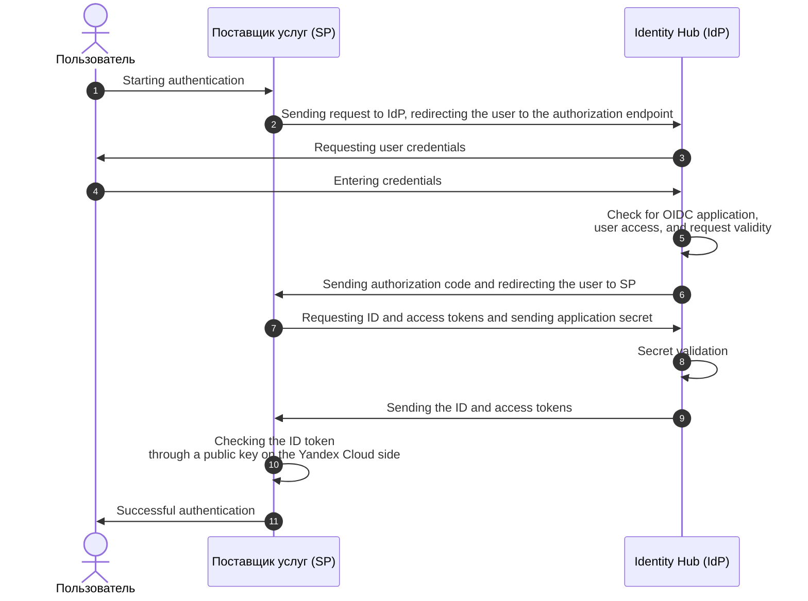

```mermaid
sequenceDiagram
  autonumber
  actor U as Пользователь
  
  participant SP as Поставщик услуг (SP)
  participant IdP as Identity Hub (IdP)

  U ->> SP: Starting authentication
  SP ->> IdP: Sending request to IdP, redirecting the user to the authorization endpoint
  IdP ->> U: Requesting user credentials
  U ->> IdP: Entering credentials
  IdP ->> IdP: Check for OIDC application,<br/>user access, and request validity
  IdP ->> SP: Sending authorization code and redirecting the user to SP
  SP ->> IdP: Requesting ID and access tokens and sending application secret
  IdP ->> IdP: Secret validation
  IdP ->> SP: Sending the ID and access tokens
  SP ->> SP: Checking the ID token<br/>through a public key on the Yandex Cloud side
  SP ->> U: Successful authentication
```
