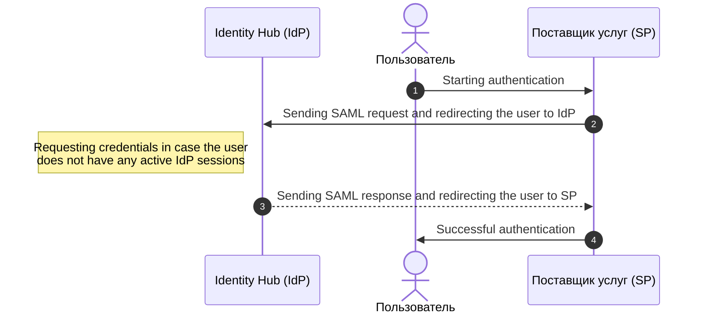

```mermaid
sequenceDiagram
    autonumber
    participant IdP as Identity Hub (IdP)
    actor U as Пользователь
    participant SP as Поставщик услуг (SP)

    U ->> SP: Starting authentication
    SP ->> IdP: Sending SAML request and redirecting the user to IdP
    Note left of IdP: Requesting credentials in case the user<br/>does not have any active IdP sessions
    IdP -->> SP: Sending SAML response and redirecting the user to SP
    SP ->> U: Successful authentication
```