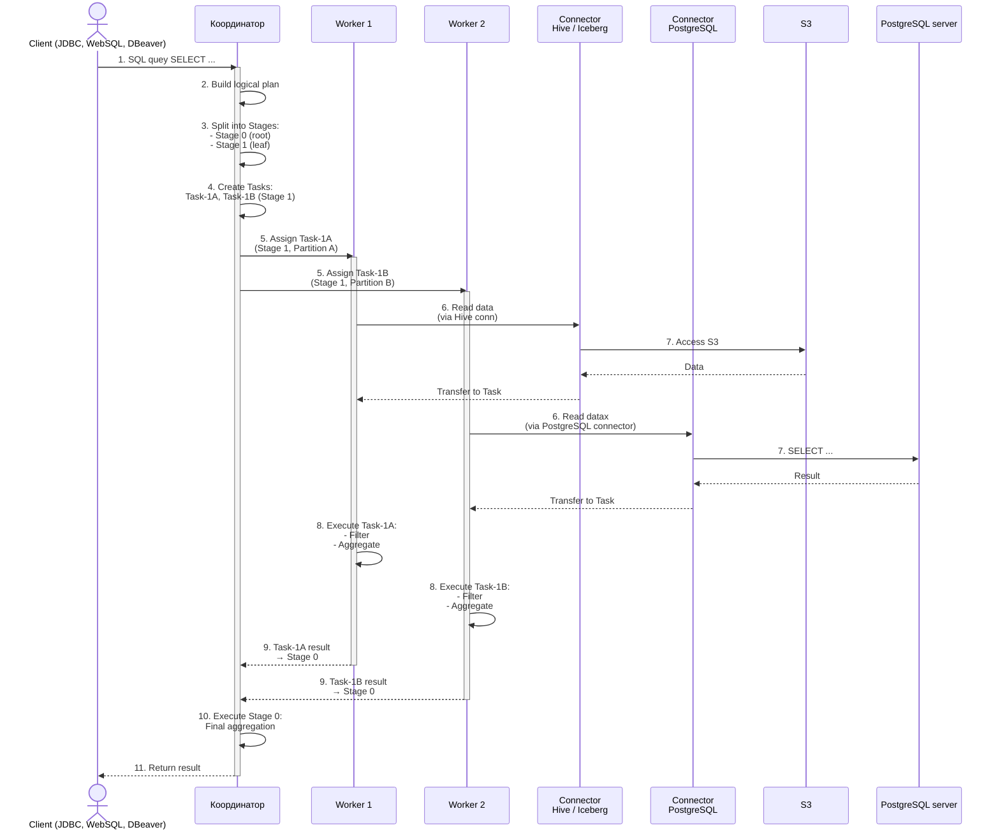

```mermaid
sequenceDiagram
  actor Client as Client (JDBC, WebSQL, DBeaver)
  participant Coordinator as Координатор
  participant Worker1 as Worker 1
  participant Worker2 as Worker 2
  participant Connector-hive as Connector<br/>Hive / Iceberg
  participant Connector-pg as Connector<br/>PostgreSQL
  participant Storage as S3
  participant Pg-server as PostgreSQL server

  Client ->> Coordinator: 1. SQL quey SELECT ...
  activate Coordinator

  Coordinator ->> Coordinator: 2. Build logical plan
  Coordinator ->> Coordinator: 3. Split into Stages:<br/>- Stage 0 (root)<br/>- Stage 1 (leaf)
  Coordinator ->> Coordinator: 4. Create Tasks:<br/>Task-1A, Task-1B (Stage 1)

  Coordinator ->> Worker1: 5. Assign Task-1A<br/>(Stage 1, Partition A)
  activate Worker1
  Coordinator ->> Worker2: 5. Assign Task-1B<br/>(Stage 1, Partition B)
  activate Worker2

  Worker1 ->> Connector-hive: 6. Read data<br/>(via Hive conn)
  Connector-hive ->> Storage: 7. Access S3
  Storage -->> Connector-hive: Data
  Connector-hive -->> Worker1: Transfer to Task

  Worker2 ->> Connector-pg: 6. Read dataх<br/>(via PostgreSQL connector)
  Connector-pg ->> Pg-server: 7. SELECT ...
  Pg-server -->> Connector-pg: Result
  Connector-pg -->> Worker2: Transfer to Task

  Worker1 ->> Worker1: 8. Execute Task-1A:<br/>- Filter<br/>- Aggregate
  Worker2 ->> Worker2: 8. Execute Task-1B:<br/>- Filter<br/>- Aggregate

  Worker1 -->> Coordinator: 9. Task-1A result<br/>→ Stage 0
  deactivate Worker1
  Worker2 -->> Coordinator: 9. Task-1B result<br/>→ Stage 0
  deactivate Worker2

  Coordinator ->> Coordinator: 10. Execute Stage 0:<br/>Final aggregation

  Coordinator -->> Client: 11. Return result
  deactivate Coordinator
```
