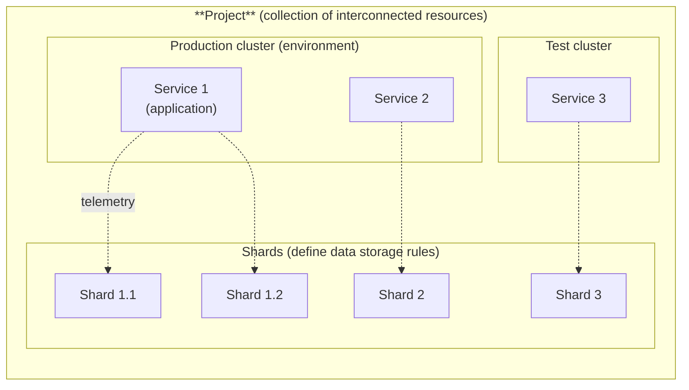

```mermaid
flowchart TB
  subgraph P["**Project** (collection of interconnected resources)"]
    direction TB

    subgraph C1["Production cluster (environment)"]
      direction TB
        direction LR
        S1["Service 1<br>(application)"]
        S2["Service 2"]
    end

    subgraph C2["Test cluster"]
      direction TB
        direction LR
        S3["Service 3"]
    end

    subgraph SH["Shards (define data storage rules)"]
      direction LR
      SH1[Shard 1.1]
      SH2[Shard 1.2]
      SH3[Shard 2]
      SH4[Shard 3]
    end

    S1 -.->|telemetry| SH1
    S1 -.->| | SH2
    S2 -.->| | SH3
    S3 -.->| | SH4
  end
```