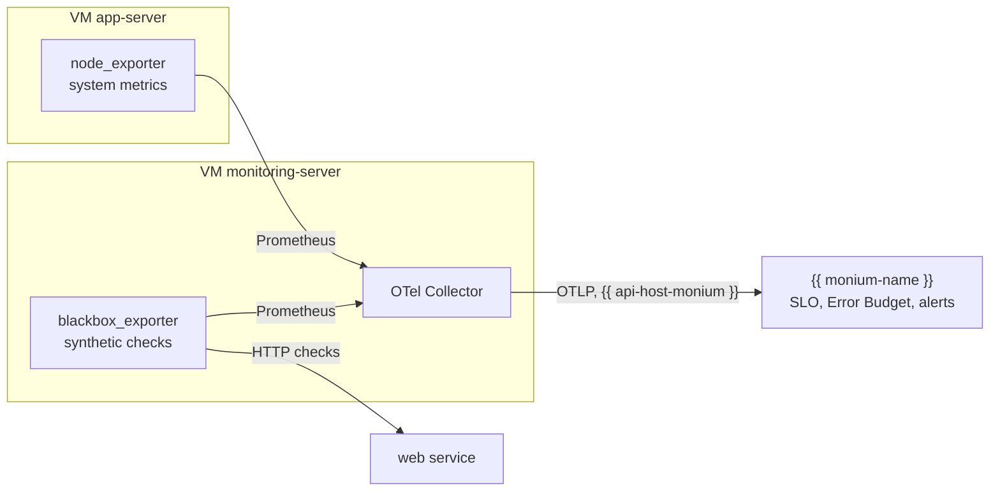

```mermaid
flowchart LR
    subgraph APP["VM app-server"]
      NE["node_exporter<br/>system metrics"]
    end

    subgraph MON["VM monitoring-server"]
      SP1[" "]
      BB["blackbox_exporter<br/>synthetic checks"]
      OTEL["OTel Collector"]
    end

    WEB["web service"]

    NE -->|"Prometheus"| OTEL
    BB -->|"Prometheus"| OTEL
    BB -->|"HTTP checks"| WEB
    OTEL -->|"OTLP, {{ api-host-monium }}"| MONIUM["{{ monium-name }}<br/>SLO, Error Budget, alerts"]

    style SP1 fill:none,stroke:none
```