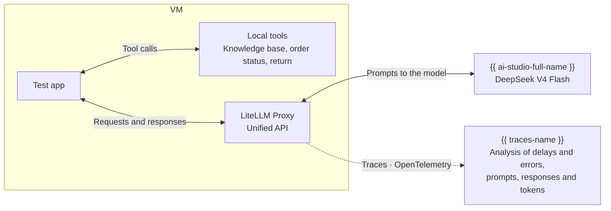

```mermaid
flowchart LR
    subgraph VM["VM"]
        APP["Test app"]
        TOOLS["Local tools<br/>Knowledge base, order status, return"]
        PROXY["LiteLLM Proxy<br/>Unified API"]

        APP <-->|"Tool calls"| TOOLS
        APP <-->|"Requests and responses"| PROXY
    end

    MODEL["{{ ai-studio-full-name }}<br/>DeepSeek V4 Flash"]
    TRACES["{{ traces-name }}<br/>Analysis of delays and errors,<br/>prompts, responses and tokens"]

    PROXY <-->|"Prompts to the model"| MODEL
    PROXY -.->|"Traces · OpenTelemetry"| TRACES
```
