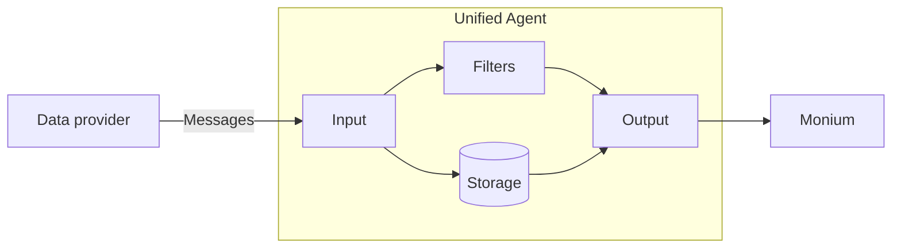

```mermaid
flowchart LR
    S[Data provider] -->|Messages| IN[Input]

    subgraph UA[Unified Agent]
      IN --> F[Filters]
      IN --> ST[(Storage)]
      F --> OUT[Output]
      ST --> OUT
    end

    OUT --> MON[Monium]
```