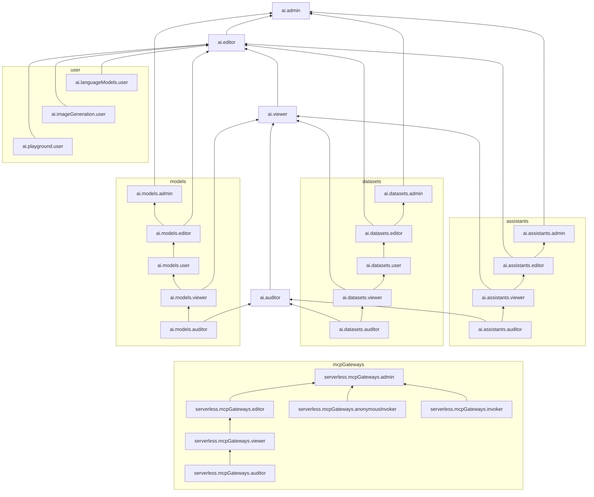

```mermaid
flowchart BT
    ai.editor --> ai.admin
    ai.viewer ---> ai.editor
    ai.auditor ------> ai.viewer

    subgraph assistants
    ai.assistants.editor --> ai.assistants.admin
    ai.assistants.viewer --> ai.assistants.editor
    ai.assistants.auditor --> ai.assistants.viewer
    end

    ai.assistants.admin --> ai.admin
    ai.assistants.editor --> ai.editor
    ai.assistants.viewer --> ai.viewer
    ai.assistants.auditor --> ai.auditor

    subgraph datasets
    ai.datasets.editor --> ai.datasets.admin
    ai.datasets.user --> ai.datasets.editor
    ai.datasets.viewer  --> ai.datasets.user
    ai.datasets.auditor --> ai.datasets.viewer 
    end

    ai.datasets.admin --> ai.admin
    ai.datasets.editor --> ai.editor
    ai.datasets.viewer --> ai.viewer
    ai.datasets.auditor --> ai.auditor

    ai.models.admin ---> ai.admin
    ai.models.editor --> ai.editor
    ai.models.viewer --> ai.viewer
    ai.models.auditor --> ai.auditor

    subgraph models
    ai.models.editor --> ai.models.admin
    ai.models.user --> ai.models.editor
    ai.models.viewer --> ai.models.user
    ai.models.auditor --> ai.models.viewer
    end

    subgraph user
    ai.imageGeneration.user ~~~ ai.languageModels.user
    ai.playground.user ~~~ ai.imageGeneration.user
    end

    ai.languageModels.user --> ai.editor
    ai.imageGeneration.user --> ai.editor
    ai.playground.user --> ai.editor

    subgraph mcpGateways
    serverless.mcpGateways.editor --> serverless.mcpGateways.admin
    serverless.mcpGateways.anonymousInvoker --> serverless.mcpGateways.admin
    serverless.mcpGateways.invoker --> serverless.mcpGateways.admin
    serverless.mcpGateways.viewer --> serverless.mcpGateways.editor
    serverless.mcpGateways.auditor --> serverless.mcpGateways.viewer
    end

    serverless.mcpGateways.admin ~~~ ai.datasets.auditor
```