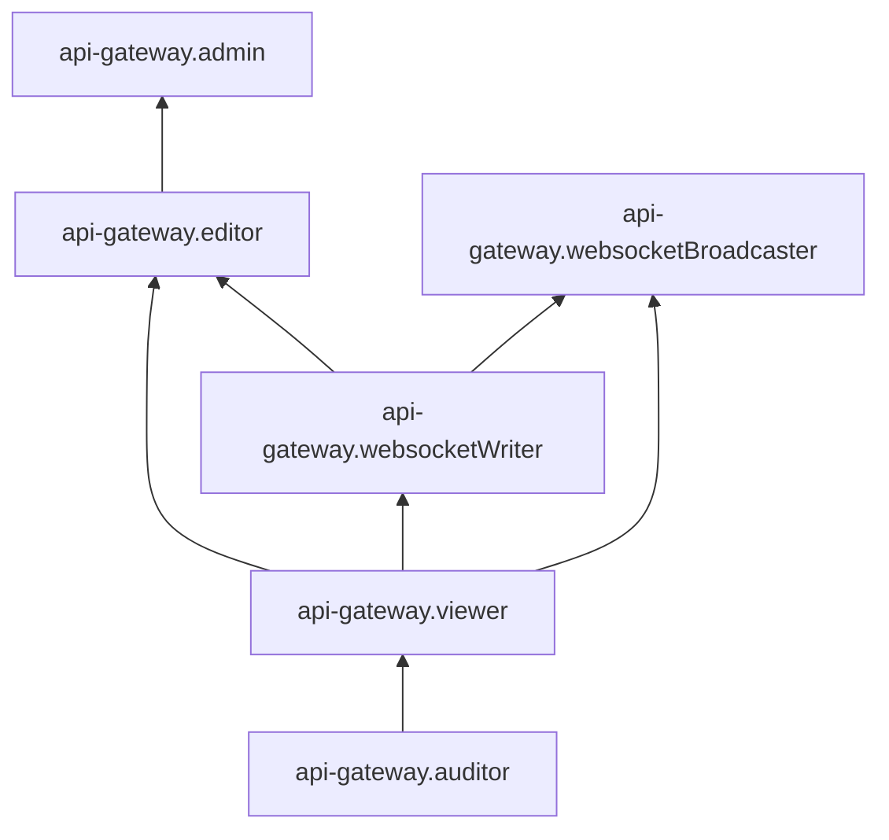

```mermaid
flowchart BT
    auditor["api-gateway.auditor"] --> viewer1["api-gateway.viewer"]
    viewer1 --> editor["api-gateway.editor"]
    viewer1 --> websocketWriter["api-gateway.websocketWriter"]
    websocketWriter --> websocketBroadcaster["api-gateway.websocketBroadcaster"]
    viewer1 --> websocketBroadcaster
    websocketWriter --> editor
    editor --> admin["api-gateway.admin"]
```