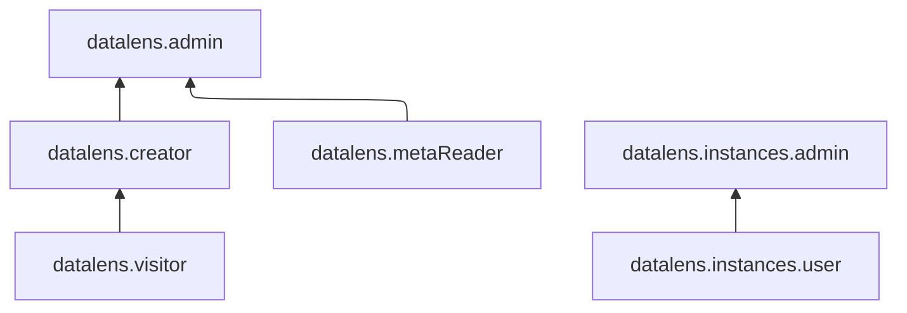

```mermaid
%%{init: {"flowchart": {'defaultRenderer': 'elk'}} }%%
flowchart BT

    dl-visitor["datalens.visitor"] --> dl-creator["datalens.creator"] --> dl-admin["datalens.admin"]
    dl-metaReader["datalens.metaReader"] --> dl-admin

    dl-instances-user["datalens.instances.user"] --> dl-instances-admin["datalens.instances.admin"]
```
