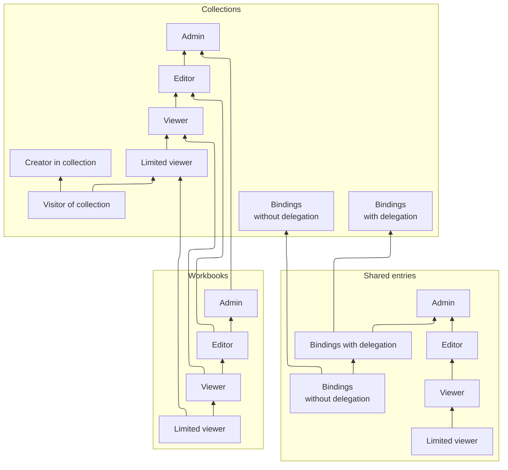

```mermaid
%%{init: {"flowchart": {'defaultRenderer': 'elk'}} }%%
flowchart BT

    subgraph sharedEntries["Shared entries"]
    dl-se-limitedViewer["Limited viewer"] --> dl-se-viewer["Viewer"] --> dl-se-editor["Editor"]
    dl-se-editor --> dl-se-admin["Admin"]

    dl-se-limitedEntryBindingCreator["Bindings
    without delegation"] --> dl-se-entryBindingCreator["Bindings with delegation"] --> dl-se-admin
    
    end;

    subgraph collections["Collections"]

        dl-coll-visitor["Visitor of collection"] --> dl-coll-creator["Creator in collection"]

    dl-coll-visitor --> dl-coll-limitedViewer["Limited viewer"] --> dl-coll-viewer["Viewer"] --> dl-coll-editor["Editor"] --> dl-coll-admin["Admin"]

    dl-coll-limitedEntryBindingCreator["Bindings
    without delegation"]
    dl-coll-entryBindingCreator["Bindings
    with delegation"]

    end;

    subgraph workbooks["Workbooks"]
    dl-wb-limitedViewer["Limited viewer"] --> dl-wb-viewer["Viewer"] --> dl-wb-editor["Editor"] --> dl-wb-admin["Admin"]
    end;

    dl-wb-limitedViewer --> dl-coll-limitedViewer
    dl-wb-viewer --> dl-coll-viewer
    dl-wb-editor --> dl-coll-editor
    dl-wb-admin --> dl-coll-admin

    dl-se-entryBindingCreator --> dl-coll-entryBindingCreator["Bindings
    with delegation"]

    dl-se-limitedEntryBindingCreator --> dl-coll-limitedEntryBindingCreator
```
