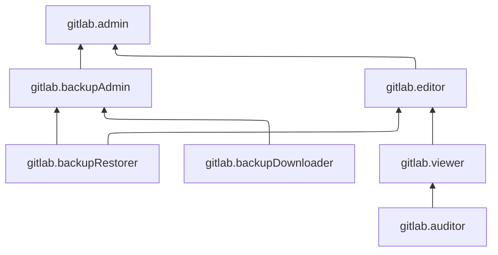

```mermaid
%%{init: {"flowchart": {'defaultRenderer': 'elk'}} }%%

flowchart BT
    gitlab.backupRestorer["gitlab.backupRestorer"] --> gitlab.backupAdmin["gitlab.backupAdmin"] --> gitlab.admin
    gitlab.backupDownloader["gitlab.backupDownloader"] --> gitlab.backupAdmin
    gitlab.backupRestorer --> gitlab.editor["gitlab.editor"] --> gitlab.admin["gitlab.admin"]
    gitlab.auditor --> gitlab.viewer --> gitlab.editor
```
