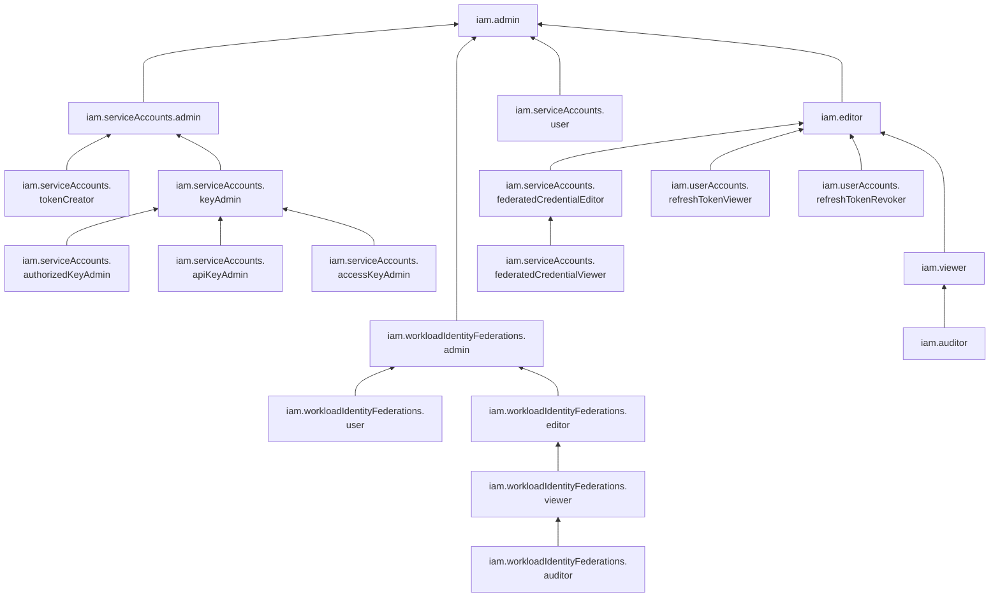

```mermaid
flowchart BT
    iam.serviceAccounts.admin ---> iam.admin
    iam.workloadIdentityFederations.admin["`iam.workloadIdentityFederations.
    admin`"]
    iam.workloadIdentityFederations.admin ------> iam.admin
    iam.workloadIdentityFederations.user["`iam.workloadIdentityFederations.
    user`"]
    iam.workloadIdentityFederations.user --> iam.workloadIdentityFederations.admin
    iam.workloadIdentityFederations.editor["`iam.workloadIdentityFederations.
    editor`"]
    iam.workloadIdentityFederations.editor --> iam.workloadIdentityFederations.admin
    iam.workloadIdentityFederations.viewer["`iam.workloadIdentityFederations.
    viewer`"]    
    iam.workloadIdentityFederations.viewer --> iam.workloadIdentityFederations.editor
    iam.workloadIdentityFederations.auditor["`iam.workloadIdentityFederations.
    auditor`"]     
    iam.workloadIdentityFederations.auditor --> iam.workloadIdentityFederations.viewer
    iam.serviceAccounts.user["`iam.serviceAccounts.
    user`"]
    iam.serviceAccounts.user ---> iam.admin
    iam.editor ---> iam.admin
    iam.serviceAccounts.tokenCreator["`iam.serviceAccounts.
    tokenCreator`"]
    iam.serviceAccounts.tokenCreator --> iam.serviceAccounts.admin
    iam.serviceAccounts.authorizedKeyAdmin["`iam.serviceAccounts.
    authorizedKeyAdmin`"]
    iam.serviceAccounts.authorizedKeyAdmin --> iam.serviceAccounts.keyAdmin
    iam.serviceAccounts.apiKeyAdmin["`iam.serviceAccounts.
    apiKeyAdmin`"]
    iam.serviceAccounts.apiKeyAdmin --> iam.serviceAccounts.keyAdmin
    iam.serviceAccounts.accessKeyAdmin["`iam.serviceAccounts.
    accessKeyAdmin`"]
    iam.serviceAccounts.accessKeyAdmin --> iam.serviceAccounts.keyAdmin
    iam.serviceAccounts.federatedCredentialEditor["`iam.serviceAccounts.
    federatedCredentialEditor`"]
    iam.serviceAccounts.federatedCredentialEditor --> iam.editor
    iam.serviceAccounts.federatedCredentialViewer["`iam.serviceAccounts.
    federatedCredentialViewer`"]
    iam.serviceAccounts.federatedCredentialViewer --> iam.serviceAccounts.federatedCredentialEditor
    iam.userAccounts.refreshTokenViewer["`iam.userAccounts.
    refreshTokenViewer`"]
    iam.userAccounts.refreshTokenViewer --> iam.editor
    iam.userAccounts.refreshTokenRevoker["`iam.userAccounts.
    refreshTokenRevoker`"]
    iam.userAccounts.refreshTokenRevoker --> iam.editor
    iam.viewer ---> iam.editor
    iam.auditor --> iam.viewer
    iam.serviceAccounts.keyAdmin["`iam.serviceAccounts.
    keyAdmin`"]
    iam.serviceAccounts.keyAdmin --> iam.serviceAccounts.admin
```