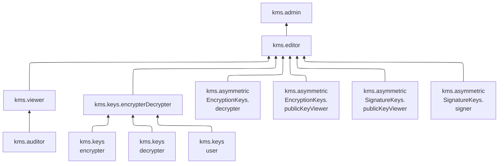

```mermaid
%%{
  init: {
    "flowchart": { "defaultRenderer": "elk" },
    "elk": { "nodePlacementStrategy": "LINEAR_SEGMENTS" }
  }
}%%
flowchart BT
    kms.auditor --> kms.viewer
    kms.viewer --> kms.editor
    kms.editor --> kms.admin
    kms.keys.encrypter["`kms.keys
    encrypter`"] --> kms.keys.encrypterDecrypter
    kms.keys.decrypter["`kms.keys
    decrypter`"] --> kms.keys.encrypterDecrypter
    kms.keys.user["`kms.keys
    user`"] --> kms.keys.encrypterDecrypter
    kms.keys.encrypterDecrypter --> kms.editor
    kms.asymmetricEncryptionKeys.decrypter["`kms.asymmetric
    EncryptionKeys.
    decrypter`"] --> kms.editor

    kms.asymmetricEncryptionKeys.publicKeyViewer["`kms.asymmetric
    EncryptionKeys.
    publicKeyViewer`"] --> kms.editor
    kms.asymmetricSignatureKeys.publicKeyViewer["`kms.asymmetric
    SignatureKeys.
    publicKeyViewer`"] --> kms.editor
    kms.asymmetricSignatureKeys.signer["`kms.asymmetric
    SignatureKeys.
    signer`"] --> kms.editor
```
