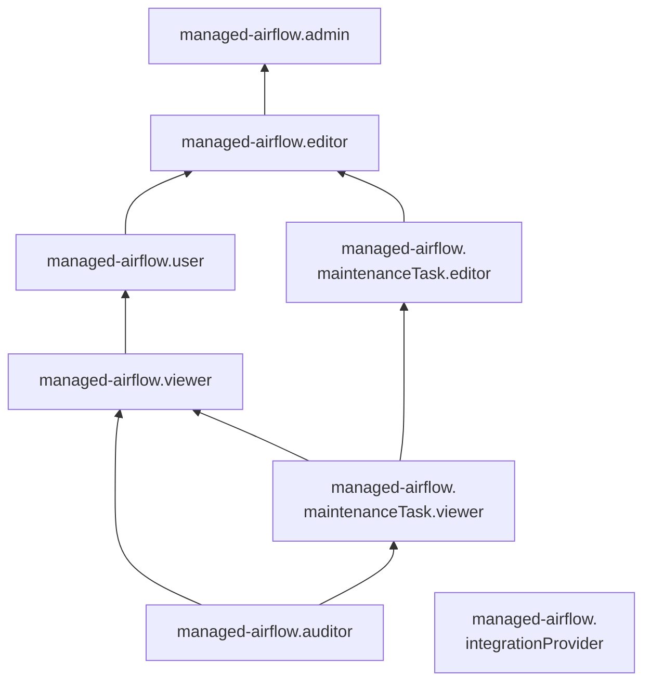

```mermaid
flowchart BT
    managed-airflow.auditor --> managed-airflow.viewer 
    managed-airflow.viewer --> managed-airflow.user 
    managed-airflow.user --> managed-airflow.editor
    managed-airflow.editor --> managed-airflow.admin
    managed-airflow.auditor --> managed-airflow.maintenanceTask.viewer["`managed-airflow.
    maintenanceTask.viewer`"]
    managed-airflow.maintenanceTask.viewer --> managed-airflow.viewer
    managed-airflow.maintenanceTask.viewer --> managed-airflow.maintenanceTask.editor["`managed-airflow.
    maintenanceTask.editor`"]
    managed-airflow.maintenanceTask.editor --> managed-airflow.editor
    managed-airflow.integrationProvider["`managed-airflow.
    integrationProvider`"]
```