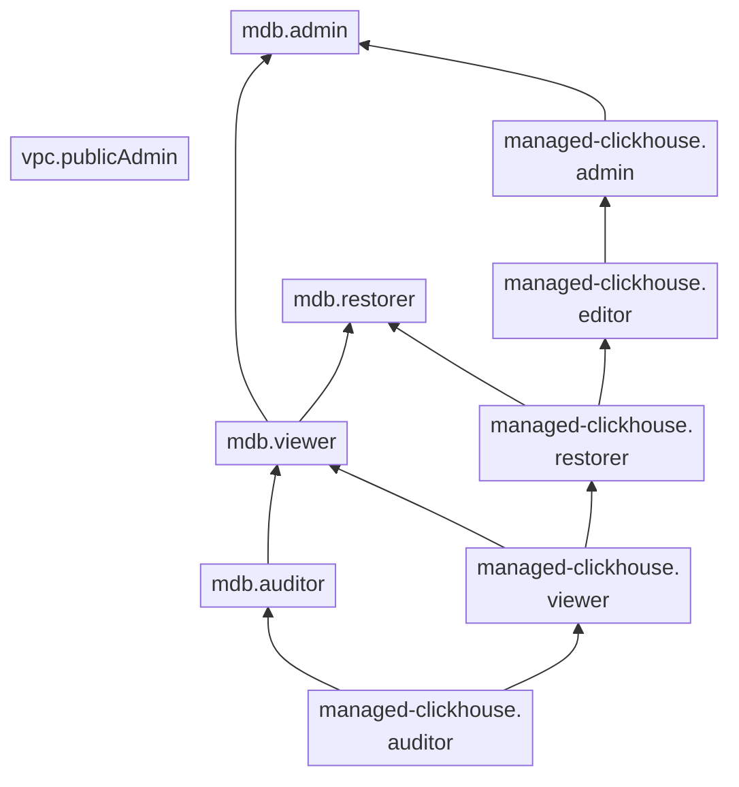

```mermaid
%%{init: { "flowchart": { "padding": 4 } } }%%
flowchart BT
    vpc.publicAdmin ~~~ mdb.admin
    mdb.viewer ----> mdb.admin
    mdb.viewer --> mdb.restorer
    mdb.restorer ~~~ mdb.admin
    managed-clickhouse.admin["`managed-clickhouse.
    admin`"] --> mdb.admin
    mdb.auditor --> mdb.viewer
    managed-clickhouse.viewer["`managed-clickhouse.
    viewer`"] --> mdb.viewer
    managed-clickhouse.auditor["`managed-clickhouse.
    auditor`"] --> mdb.auditor
    managed-clickhouse.editor["`managed-clickhouse.
    editor`"] --> managed-clickhouse.admin
    managed-clickhouse.restorer["`managed-clickhouse.
    restorer`"] --> mdb.restorer
    managed-clickhouse.restorer --> managed-clickhouse.editor
    managed-clickhouse.viewer --> managed-clickhouse.restorer
    managed-clickhouse.auditor --> managed-clickhouse.viewer
```