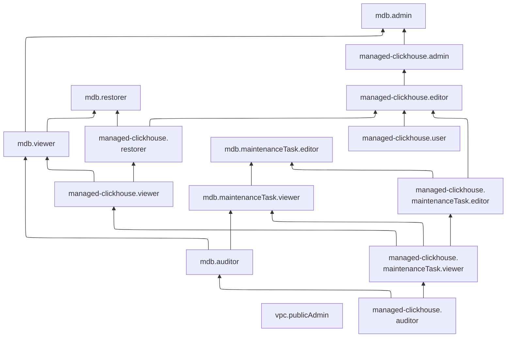

```mermaid
%%{init: {"flowchart": {'defaultRenderer': 'elk'}} }%%
flowchart BT
    mdb.viewer --> mdb.admin
    mdb.viewer --> mdb.restorer
    vpc.publicAdmin
    managed-clickhouse.admin --> mdb.admin
    managed-clickhouse.viewer --> managed-clickhouse.restorer
    managed-clickhouse.restorer["`managed-clickhouse.
    restorer`"] --> managed-clickhouse.editor
    mdb.auditor --> mdb.maintenanceTask.viewer
    mdb.maintenanceTask.viewer --> mdb.maintenanceTask.editor
    managed-clickhouse.maintenanceTask.viewer --> mdb.maintenanceTask.viewer
    managed-clickhouse.maintenanceTask.editor --> managed-clickhouse.editor
    managed-clickhouse.maintenanceTask.viewer --> managed-clickhouse.viewer
    managed-clickhouse.maintenanceTask.viewer --> managed-clickhouse.maintenanceTask.editor["`managed-clickhouse.
    maintenanceTask.editor`"]
    managed-clickhouse.maintenanceTask.editor --> mdb.maintenanceTask.editor
    managed-clickhouse.auditor --> managed-clickhouse.maintenanceTask.viewer["`managed-clickhouse.
    maintenanceTask.viewer`"]
    mdb.auditor --> mdb.viewer
    managed-clickhouse.viewer --> mdb.viewer
    managed-clickhouse.auditor["`managed-clickhouse.
    auditor`"] --> mdb.auditor
    managed-clickhouse.editor --> managed-clickhouse.admin
    managed-clickhouse.restorer --> mdb.restorer
    managed-clickhouse.user --> managed-clickhouse.editor
```