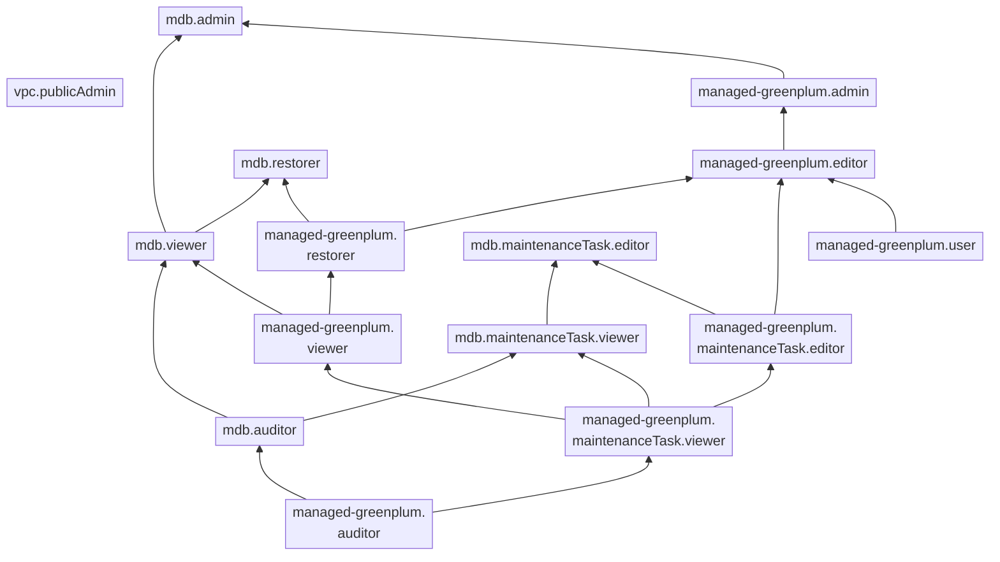

```mermaid
%%{init: { "flowchart": { "padding": 4 } } }%%
flowchart BT
    vpc.publicAdmin ~~~ mdb.admin
    mdb.viewer --> mdb.admin
    mdb.viewer ~~~ mdb.admin
    mdb.restorer ~~~ mdb.admin
    mdb.viewer --> mdb.restorer
    managed-greenplum.admin --> mdb.admin
    managed-greenplum.viewer --> managed-greenplum.restorer["`managed-greenplum.
    restorer`"]
    managed-greenplum.restorer --> managed-greenplum.editor
    mdb.auditor --> mdb.maintenanceTask.viewer
    mdb.maintenanceTask.viewer --> mdb.maintenanceTask.editor
    managed-greenplum.maintenanceTask.viewer --> mdb.maintenanceTask.viewer
    managed-greenplum.maintenanceTask.editor --> managed-greenplum.editor
    managed-greenplum.maintenanceTask.viewer --> managed-greenplum.viewer["`managed-greenplum.
    viewer`"]
    managed-greenplum.maintenanceTask.viewer --> managed-greenplum.maintenanceTask.editor["`managed-greenplum.
    maintenanceTask.editor`"]
    managed-greenplum.maintenanceTask.editor --> mdb.maintenanceTask.editor
    managed-greenplum.auditor --> managed-greenplum.maintenanceTask.viewer["`managed-greenplum.
    maintenanceTask.viewer`"]
    mdb.auditor --> mdb.viewer
    managed-greenplum.viewer --> mdb.viewer
    managed-greenplum.auditor["`managed-greenplum.
    auditor`"] --> mdb.auditor
    managed-greenplum.editor --> managed-greenplum.admin
    managed-greenplum.restorer --> mdb.restorer
    managed-greenplum.user --> managed-greenplum.editor
```