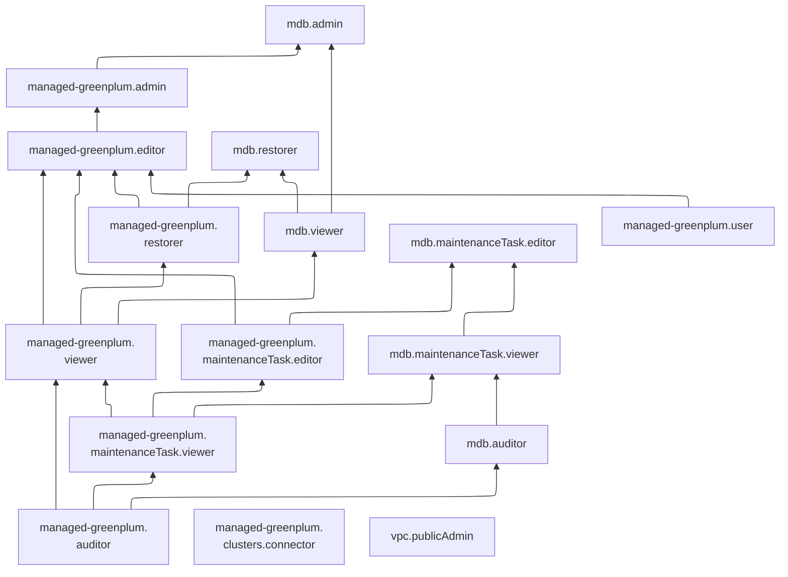

```mermaid
%%{
  init: {
    "flowchart": { "defaultRenderer": "elk" },
    "elk": { "nodePlacementStrategy": "NETWORK_SIMPLEX" }
  }
}%%
flowchart BT
    managed-greenplum.auditor --> managed-greenplum.viewer --> managed-greenplum.editor
    managed-greenplum.maintenanceTask.viewer --> managed-greenplum.maintenanceTask.editor
    managed-greenplum.maintenanceTask.viewer --> managed-greenplum.viewer["`managed-greenplum.
    viewer`"]
    managed-greenplum.maintenanceTask.viewer --> mdb.maintenanceTask.viewer
    mdb.auditor --> mdb.maintenanceTask.viewer
    managed-greenplum.viewer --> managed-greenplum.restorer["`managed-greenplum.
    restorer`"]
    managed-greenplum.viewer --> mdb.viewer
    managed-greenplum.restorer --> managed-greenplum.editor
    mdb.maintenanceTask.viewer --> mdb.maintenanceTask.editor
    managed-greenplum.maintenanceTask.editor --> mdb.maintenanceTask.editor
    managed-greenplum.maintenanceTask.editor["`managed-greenplum.
    maintenanceTask.editor`"] --> managed-greenplum.editor
    managed-greenplum.auditor["`managed-greenplum.
    auditor`"] --> managed-greenplum.maintenanceTask.viewer["`managed-greenplum.
    maintenanceTask.viewer`"]
    managed-greenplum.auditor --> mdb.auditor
    managed-greenplum.user --> managed-greenplum.editor
    managed-greenplum.editor --> managed-greenplum.admin
    managed-greenplum.restorer --> mdb.restorer
    mdb.viewer --> mdb.restorer
    managed-greenplum.admin --> mdb.admin
    mdb.viewer --> mdb.admin
    managed-greenplum.clusters.connector["`managed-greenplum.
  clusters.connector`"]
    vpc.publicAdmin
```
