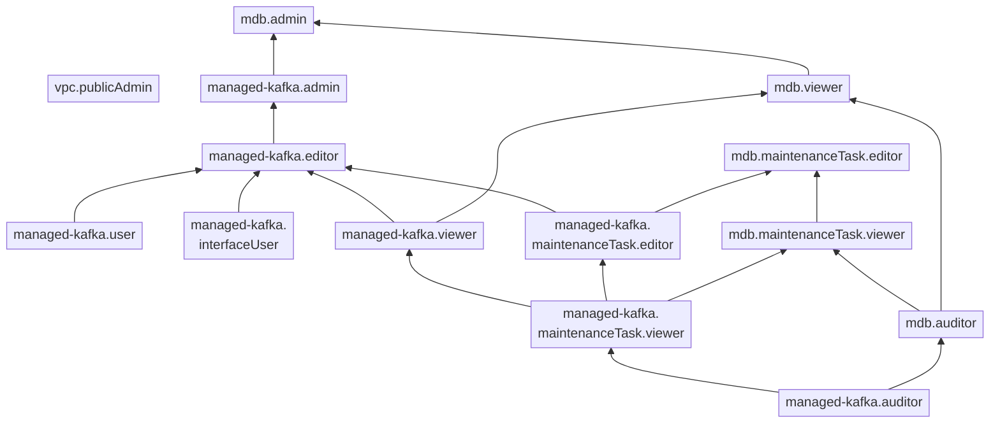

```mermaid
%%{init: { "flowchart": { "padding": 4 } } }%%
flowchart BT
    vpc.publicAdmin ~~~ mdb.admin
    mdb.maintenanceTask.editor ~~~ mdb.viewer
    managed-kafka.user --> managed-kafka.editor
    managed-kafka.interfaceUser["`managed-kafka.
    interfaceUser`"] --> managed-kafka.editor
    managed-kafka.viewer --> managed-kafka.editor
    managed-kafka.viewer --> mdb.viewer
    managed-kafka.maintenanceTask.viewer --> managed-kafka.viewer
    managed-kafka.maintenanceTask.viewer --> managed-kafka.maintenanceTask.editor["`managed-kafka.
    maintenanceTask.editor`"]
    managed-kafka.maintenanceTask.editor --> managed-kafka.editor
    managed-kafka.maintenanceTask.editor --> mdb.maintenanceTask.editor
    managed-kafka.editor --> managed-kafka.admin
    managed-kafka.admin --> mdb.admin
    managed-kafka.auditor --> managed-kafka.maintenanceTask.viewer["`managed-kafka.
    maintenanceTask.viewer`"]
    mdb.maintenanceTask.viewer --> mdb.maintenanceTask.editor
    managed-kafka.maintenanceTask.viewer --> mdb.maintenanceTask.viewer
    mdb.auditor --> mdb.maintenanceTask.viewer
    mdb.viewer --> mdb.admin
    managed-kafka.auditor --> mdb.auditor
    mdb.auditor --> mdb.viewer
```